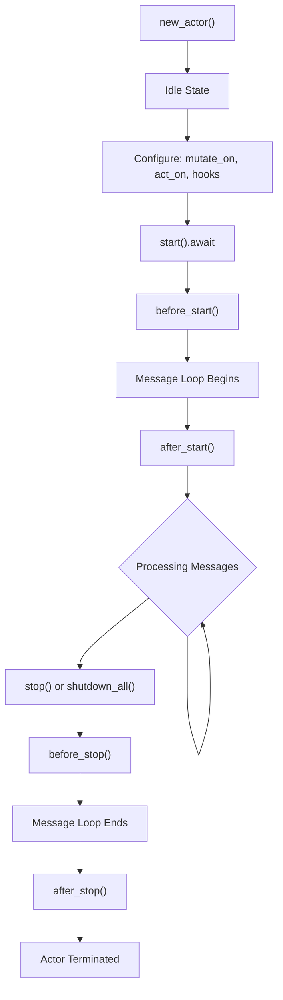
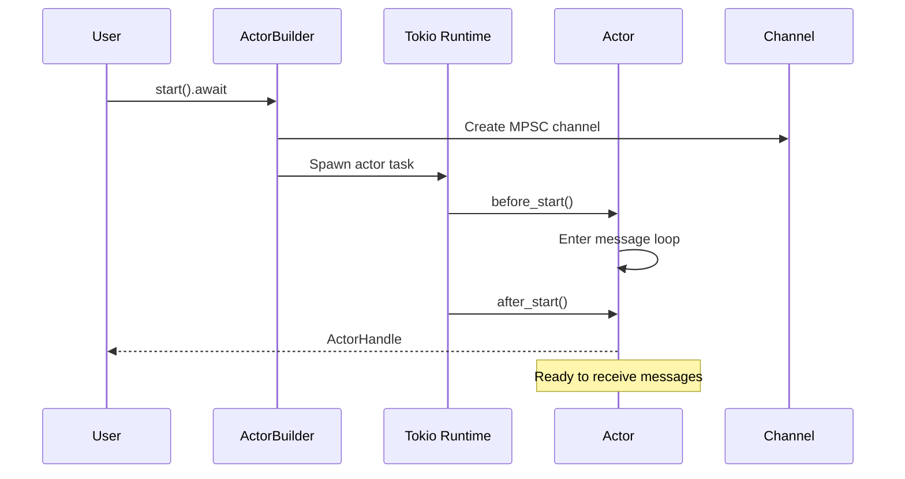
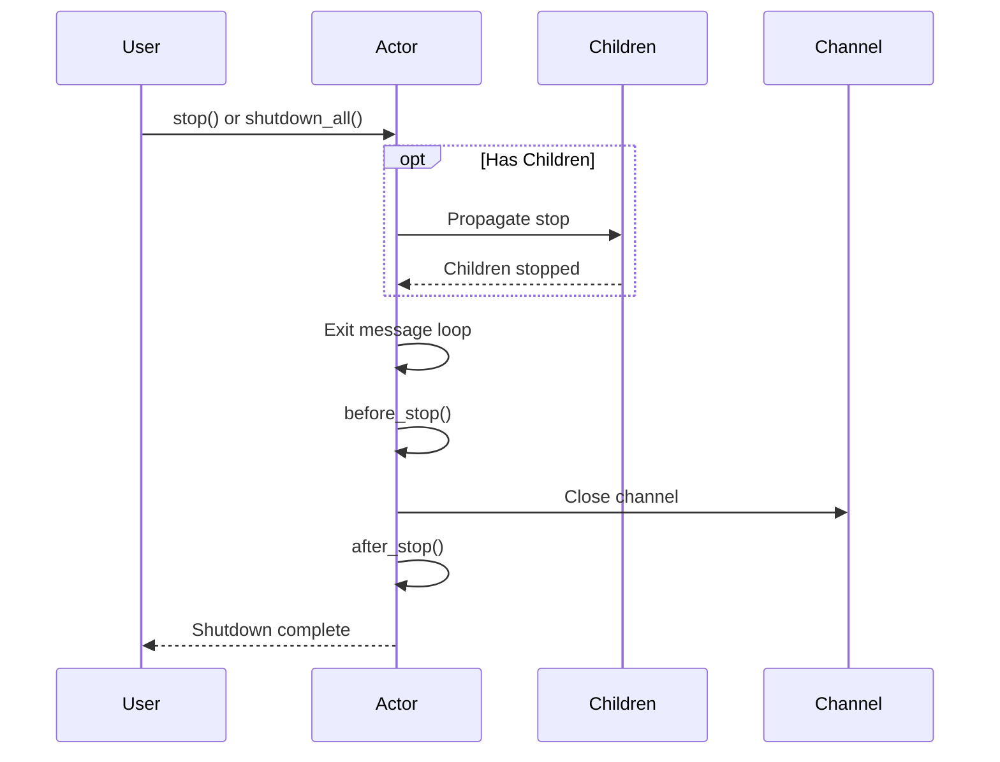

Actors go through distinct phases from creation to shutdown. Understanding the lifecycle helps you initialize resources, clean up properly, and debug actor behavior.

---

## Lifecycle Overview



---

## Lifecycle Hooks

Hooks let you run code at specific points in the actor's life:

```rust
actor
    .before_start(|actor| {
        println!("Preparing to start...");
        Reply::ready()
    })
    .after_start(|actor| {
        println!("Started and ready for messages!");
        Reply::ready()
    })
    .before_stop(|actor| {
        println!("About to stop...");
        Reply::ready()
    })
    .after_stop(|actor| {
        println!("Fully stopped.");
        Reply::ready()
    });
```

### Hook Timing


### When to Use Each Hook

| Hook | Runs | Use For |
|------|------|---------|
| `before_start` | Before message loop | Load config, open connections, validate state |
| `after_start` | After loop starts | Send initial messages, notify others |
| `before_stop` | When stop requested | Cleanup, save state, flush buffers |
| `after_stop` | After fully stopped | Final logging, assertions in tests |

---

## before_start

Runs before the actor starts processing messages:

```rust
actor.before_start(|actor| {
    println!("Actor {} is starting", actor.id());

    // Async initialization
    Reply::pending(async move {
        // Load configuration
        let config = load_config().await;

        // Can't modify actor.model here (moved into async)
        // Use a self-message pattern instead
    })
});
```

**Common uses:**
- Logging startup
- Validating configuration
- Opening database connections
- Starting background tasks

### Initialization Pattern

Since you can't modify state in an async block, use self-messaging:

```rust
#[acton_message]
struct Initialize { config: Config }

actor
    .before_start(|actor| {
        let self_handle = actor.handle().clone();

        Reply::pending(async move {
            let config = load_config().await;
            self_handle.send(Initialize { config }).await;
        })
    })
    .mutate_on::<Initialize>(|actor, ctx| {
        actor.model.config = Some(ctx.message().config.clone());
        Reply::ready()
    });
```

---

## after_start

Runs after the message loop has started:

```rust
actor.after_start(|actor| {
    let self_handle = actor.handle().clone();

    Reply::pending(async move {
        // Start a periodic timer
        tokio::spawn(async move {
            loop {
                tokio::time::sleep(Duration::from_secs(60)).await;
                self_handle.send(Heartbeat).await;
            }
        });
    })
});
```

**Common uses:**
- Starting periodic tasks
- Sending initial messages
- Notifying other actors of startup

---

## before_stop

Runs when shutdown is requested, before the message loop ends:

```rust
actor.before_stop(|actor| {
    println!("Stopping actor {}", actor.id());

    // Sync cleanup
    actor.model.active = false;

    // Or async cleanup
    let db = actor.model.db_connection.clone();
    Reply::pending(async move {
        db.flush().await;
    })
});
```

**Common uses:**
- Flushing buffers
- Saving state to disk
- Notifying dependencies
- Closing connections gracefully

---

## after_stop

Runs after the actor has fully stopped:

```rust
actor.after_stop(|actor| {
    println!("Actor {} final state: {:?}", actor.id(), actor.model);

    // Great for test assertions
    #[cfg(test)]
    assert_eq!(actor.model.processed_count, 10);

    Reply::ready()
});
```

**Common uses:**
- Final logging
- Test assertions
- Cleanup verification

---

## Startup Sequence in Detail

When you call `start().await`:



**Key points:**
- `start()` spawns a Tokio task for the actor
- `before_start` runs inside that task
- The message loop starts immediately after
- `after_start` runs once the loop is active
- The handle is returned after everything is ready

---

## Shutdown Sequence in Detail

When shutdown is triggered:



**Key points:**
- Stop propagates to children first (if any)
- Children stop before parent completes
- Channels close after `before_stop`
- `after_stop` runs last

---

## Graceful Shutdown

### Stopping a Single Actor

```rust
let handle = actor.start().await;

// Later...
handle.stop().await;
```

### Stopping All Actors

```rust
let mut runtime = ActonApp::launch();

// Create and start actors...

// Shutdown everything
runtime.shutdown_all().await?;
```

### Shutdown Timeout

Configure in `config.toml`:

```toml
[timeouts]
actor_shutdown = 5000    # 5 seconds per actor
system_shutdown = 15000  # 15 seconds total
```

If an actor doesn't stop within the timeout, it's forcefully terminated.

---

## Error Handling in Hooks

Hooks should handle their own errors:

```rust
actor.before_start(|actor| {
    Reply::pending(async move {
        match load_config().await {
            Ok(config) => {
                // Success - continue startup
            }
            Err(e) => {
                // Log error, but startup continues
                tracing::error!("Failed to load config: {}", e);
            }
        }
    })
});
```


Even if a hook errors or panics, the actor still starts. Design your handlers to handle missing initialization gracefully.


---

## Testing Lifecycle

Hooks are great for test assertions:

```rust
#[tokio::test]
async fn test_actor_processes_all_messages() {
    let mut runtime = ActonApp::launch();
    let mut actor = runtime.new_actor::<Counter>();

    actor
        .mutate_on::<Increment>(|actor, _| {
            actor.model.count += 1;
            Reply::ready()
        })
        .after_stop(|actor| {
            // Verify final state
            assert_eq!(actor.model.count, 3);
            Reply::ready()
        });

    let handle = actor.start().await;

    handle.send(Increment).await;
    handle.send(Increment).await;
    handle.send(Increment).await;

    // Give time to process
    tokio::time::sleep(Duration::from_millis(50)).await;

    runtime.shutdown_all().await.unwrap();
    // after_stop assertion runs during shutdown
}
```

---

## Next Steps

- [Supervision](/docs/supervision) - Parent-child relationships and cascading shutdown
- [Handler Types](/docs/handler-types) - How handlers execute within the lifecycle
- [Configuration](/docs/configuration) - Configuring timeouts and other settings
