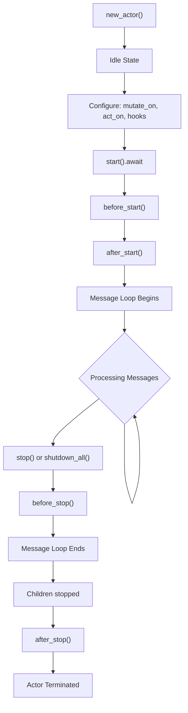
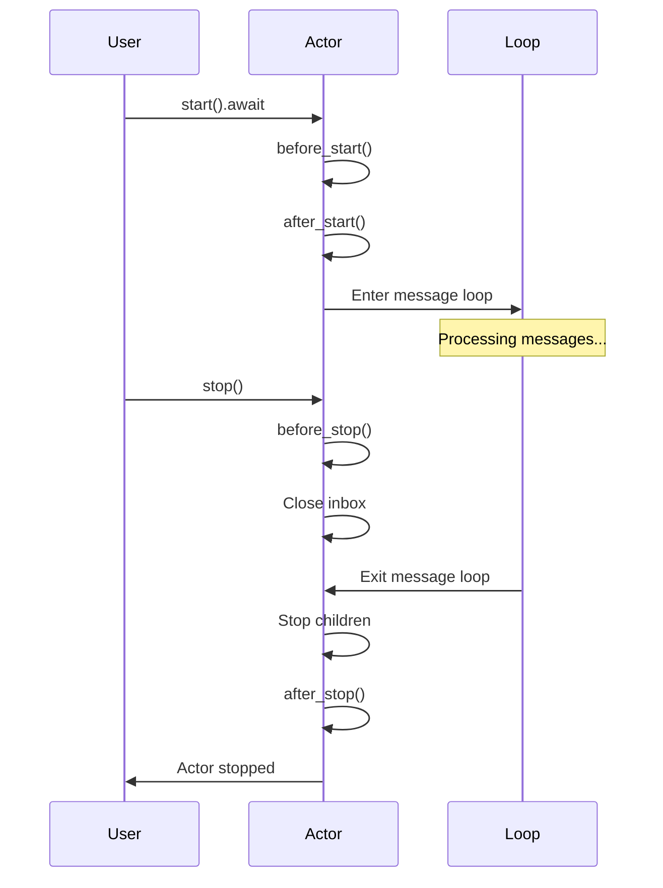
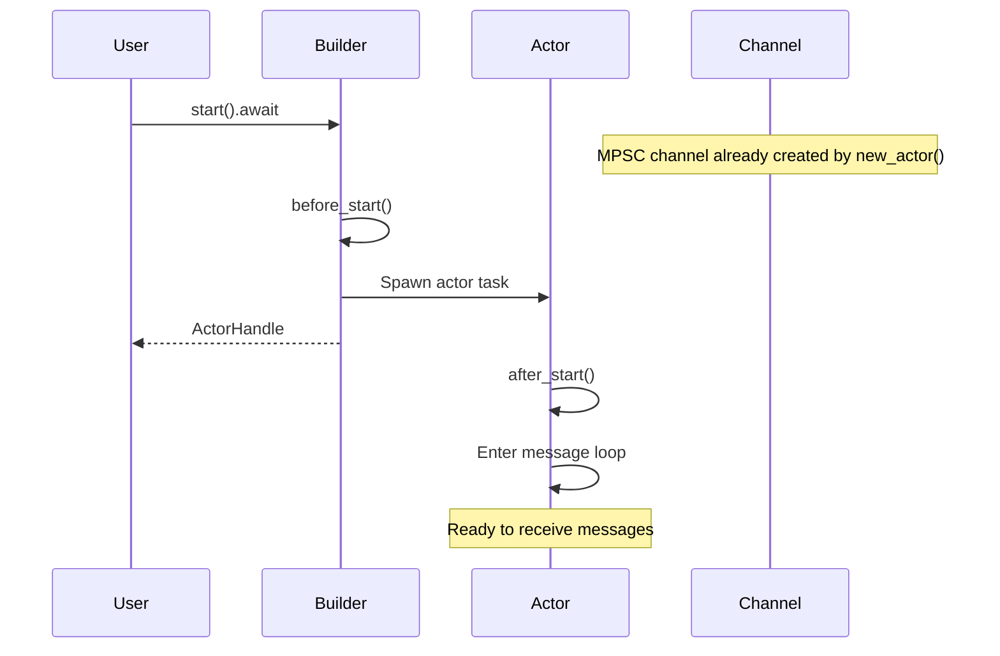
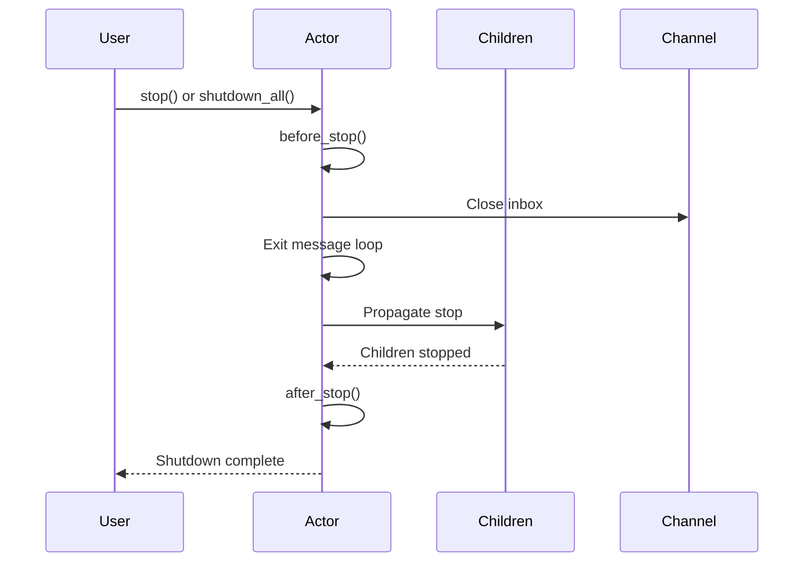

Actors go through distinct phases from creation to shutdown. Understanding the lifecycle helps you initialize resources, clean up properly, and debug actor behavior.

---

## Lifecycle Overview


```mermaid
flowchart TD
    A["new_actor()"] --> B["Idle State"]
    B --> C["Configure: mutate_on, act_on, hooks"]
    C --> D["start().await"]
    D --> E["before_start()"]
    E --> F["after_start()"]
    F --> G["Message Loop Begins"]
    G --> H{"Processing Messages"}
    H --> H
    H --> I["stop() or shutdown_all()"]
    I --> J["before_stop()"]
    J --> K["Message Loop Ends"]
    K --> L["Children stopped"]
    L --> M["after_stop()"]
    M --> N["Actor Terminated"]
```

---

## Lifecycle Hooks

Hooks let you run code at specific points in the actor's life:

```rust
actor
    .before_start(|actor| {
        println!("Preparing to start...");
        Reply::ready()
    })
    .after_start(|actor| {
        println!("Started and ready for messages!");
        Reply::ready()
    })
    .before_stop(|actor| {
        println!("About to stop...");
        Reply::ready()
    })
    .after_stop(|actor| {
        println!("Fully stopped.");
        Reply::ready()
    });
```

### Hook Timing


```mermaid
sequenceDiagram
    participant HT_U as User
    participant HT_A as Actor
    participant HT_L as Loop
    HT_U->>HT_A: start().await
    HT_A->>HT_A: before_start()
    HT_A->>HT_A: after_start()
    HT_A->>HT_L: Enter message loop
    Note over HT_L: Processing messages...
    HT_U->>HT_A: stop()
    HT_A->>HT_A: before_stop()
    HT_A->>HT_A: Close inbox
    HT_L->>HT_A: Exit message loop
    HT_A->>HT_A: Stop children
    HT_A->>HT_A: after_stop()
    HT_A->>HT_U: Actor stopped
```

### When to Use Each Hook

| Hook | Runs | Use For |
|------|------|---------|
| `before_start` | Inside `start().await`, before the actor task is spawned | Logging, sync validation (cannot send messages yet) |
| `after_start` | As the actor task begins, immediately before the message loop | Async init, send messages, notify others, start timers |
| `before_stop` | When a graceful stop is requested (skipped on forced shutdown) | Cleanup, save state, flush buffers |
| `after_stop` | After the loop exits and children have stopped (always runs) | Final logging, assertions in tests |


The message loop isn't active during `before_start`. If you need to send initialization messages (including to yourself), use `after_start` instead.


---

## before_start

Runs before the actor starts processing messages. The message loop is **not active yet**, so you cannot send or receive messages.

```rust
actor.before_start(|actor| {
    println!("Actor {} is starting", actor.id());

    // Synchronous validation or logging
    if actor.model.some_field.is_empty() {
        tracing::warn!("Actor starting with empty field");
    }

    Reply::ready()
});
```

**Common uses:**
- Logging startup
- Synchronous validation
- Reading environment variables


Messages sent during `before_start` won't be processed until the loop starts. For async initialization that requires messaging, use `after_start` instead.


### Custom Default for Complex State

If you need to initialize state that doesn't implement `Default`, use `#[acton_actor(no_default)]` and provide your own `Default` implementation:

```rust
use std::io::{stdout, Stdout};

#[acton_actor(no_default)]
struct Printer {
    out: Stdout,
}

impl Default for Printer {
    fn default() -> Self {
        Self { out: stdout() }
    }
}
```

This is cleaner than trying to initialize in lifecycle hooks.

---

## after_start

Runs after the message loop has started. This is where you can safely send messages, including to yourself.

```rust
actor.after_start(|actor| {
    let self_handle = actor.handle().clone();

    Reply::pending(async move {
        // Start a periodic timer
        tokio::spawn(async move {
            loop {
                tokio::time::sleep(Duration::from_secs(60)).await;
                self_handle.send(Heartbeat).await;
            }
        });
    })
});
```

**Common uses:**
- Starting periodic tasks
- Async initialization that requires messaging
- Sending initial messages
- Notifying other actors of startup

### Async Initialization Pattern

For resources that require async setup (like database connections), initialize in `after_start`:

```rust
#[acton_message]
struct SetConnection(Connection);

actor
    .after_start(|actor| {
        let self_handle = actor.handle().clone();
        Reply::pending(async move {
            let conn = Database::connect("...").await.unwrap();
            self_handle.send(SetConnection(conn)).await;
        })
    })
    .mutate_on::<SetConnection>(|actor, ctx| {
        actor.model.connection = Some(ctx.message().0.clone());
        Reply::ready()
    });
```

---

## before_stop

Runs when shutdown is requested, before the message loop ends:

```rust
actor.before_stop(|actor| {
    println!("Stopping actor {}", actor.id());

    // Sync cleanup
    actor.model.active = false;

    // Or async cleanup
    let db = actor.model.db_connection.clone();
    Reply::pending(async move {
        db.flush().await;
    })
});
```

**Common uses:**
- Flushing buffers
- Saving state to disk
- Notifying dependencies
- Closing connections gracefully

---

## after_stop

Runs after the actor has fully stopped:

```rust
actor.after_stop(|actor| {
    println!("Actor {} final state: {:?}", actor.id(), actor.model);

    // Great for test assertions
    #[cfg(test)]
    assert_eq!(actor.model.processed_count, 10);

    Reply::ready()
});
```

**Common uses:**
- Final logging
- Test assertions
- Cleanup verification

---

## Startup Sequence in Detail

When you call `start().await`:


```mermaid
sequenceDiagram
    participant ST_U as User
    participant ST_B as Builder
    participant ST_A as Actor
    participant ST_C as Channel
    ST_U->>ST_B: start().await
    Note over ST_C: MPSC channel already created by new_actor()
    ST_B->>ST_B: before_start()
    ST_B->>ST_A: Spawn actor task
    ST_B-->>ST_U: ActorHandle
    ST_A->>ST_A: after_start()
    ST_A->>ST_A: Enter message loop
    Note over ST_A: Ready to receive messages
```

**Key points:**
- The actor's MPSC channel is created earlier, when `new_actor()` builds the actor
- `before_start` runs inline inside `start().await`, in the caller's task, before anything is spawned
- `start()` then spawns a Tokio task for the actor and returns the handle immediately
- `after_start` runs as the actor task begins, immediately before the message loop — it may still be running when `start()` returns
- Messages sent right after `start()` queue in the channel and are processed once the loop begins

---

## Shutdown Sequence in Detail

When shutdown is triggered:


```mermaid
sequenceDiagram
    participant SD_U as User
    participant SD_A as Actor
    participant SD_Ch as Children
    participant SD_C as Channel
    SD_U->>SD_A: stop() or shutdown_all()
    SD_A->>SD_A: before_stop()
    SD_A->>SD_C: Close inbox
    SD_A->>SD_A: Exit message loop
    SD_A->>SD_Ch: Propagate stop
    SD_Ch-->>SD_A: Children stopped
    SD_A->>SD_A: after_stop()
    SD_A-->>SD_U: Shutdown complete
```

**Key points:**
- `before_stop` runs first, then the inbox closes and the loop drains and exits
- Children are stopped after the loop exits, before `after_stop` — so children finish before the parent completes
- `before_stop` only runs on a graceful stop (`stop()` / terminate signal); on a forced shutdown (cancellation) or an unexpectedly closed inbox, it is skipped
- `after_stop` always runs, last

---

## Graceful Shutdown

### Stopping a Single Actor

```rust
let handle = actor.start().await;

// Later...
handle.stop().await;
```

### Stopping All Actors

```rust
let mut runtime = ActonApp::launch_async().await;

// Create and start actors...

// Shutdown everything
runtime.shutdown_all().await?;
```

### Shutdown Timeout

Configure in `~/.config/acton/config.toml`:

```toml
[timeouts]
actor_shutdown = 5000    # 5 seconds per actor
system_shutdown = 15000  # 15 seconds total
```

The two timeouts behave differently: if the whole system doesn't stop within `system_shutdown`, remaining actors are forcefully cancelled. The per-child `actor_shutdown` timeout only logs an error for a child that fails to stop in time — it does not force-kill it.

---

## Error Handling in Hooks

Hooks should handle their own errors:

```rust
actor.before_start(|actor| {
    Reply::pending(async move {
        match load_config().await {
            Ok(config) => {
                // Success - continue startup
            }
            Err(e) => {
                // Log error, but startup continues
                tracing::error!("Failed to load config: {}", e);
            }
        }
    })
});
```


Even if a hook errors or panics, the actor still starts — provided the default `catch-handler-panics` feature is enabled. With `default-features = false`, a panicking `before_start` propagates out of `start().await` into the caller. Design your handlers to handle missing initialization gracefully.


---

## Testing Lifecycle

Hooks are great for test assertions:

```rust
#[tokio::test]
async fn test_actor_processes_all_messages() {
    let mut runtime = ActonApp::launch_async().await;
    let mut actor = runtime.new_actor::<Counter>();

    actor
        .mutate_on::<Increment>(|actor, _| {
            actor.model.count += 1;
            Reply::ready()
        })
        .after_stop(|actor| {
            // Verify final state
            assert_eq!(actor.model.count, 3);
            Reply::ready()
        });

    let handle = actor.start().await;

    handle.send(Increment).await;
    handle.send(Increment).await;
    handle.send(Increment).await;

    // A reply proves all three increments were handled: inboxes are FIFO,
    // so this request sits behind them.
    let count = handle.ask(GetCount).await.unwrap();
    assert_eq!(count.0, 3);

    runtime.shutdown_all().await.unwrap();
    // after_stop assertion runs during shutdown
}
```

---

## Next Steps

- [Supervision](/docs/core-concepts/supervision-basics) - Parent-child relationships and cascading shutdown
- [Handler Types](/docs/handler-types) - How handlers execute within the lifecycle
- [Configuration](/docs/configuration) - Configuring timeouts and other settings
