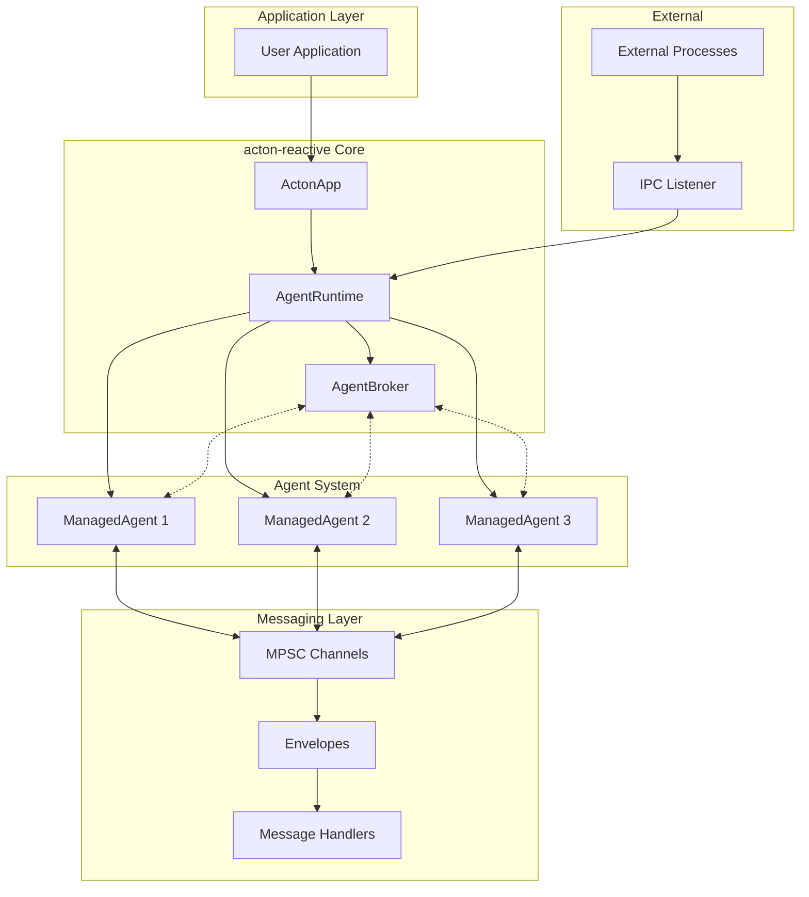
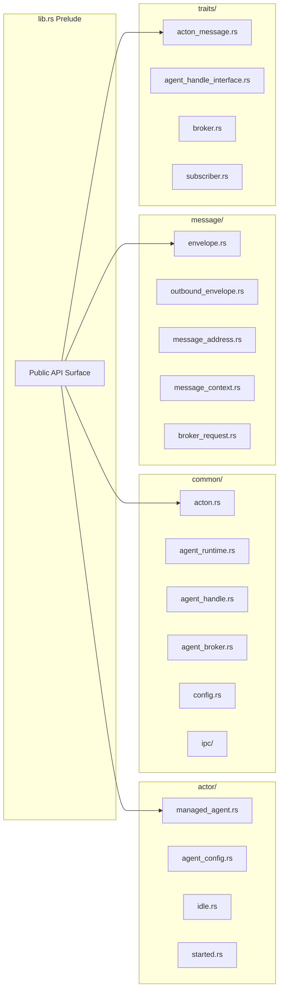
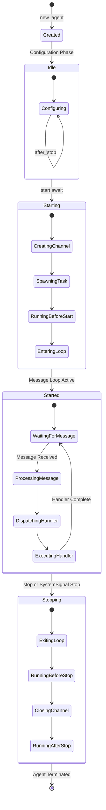
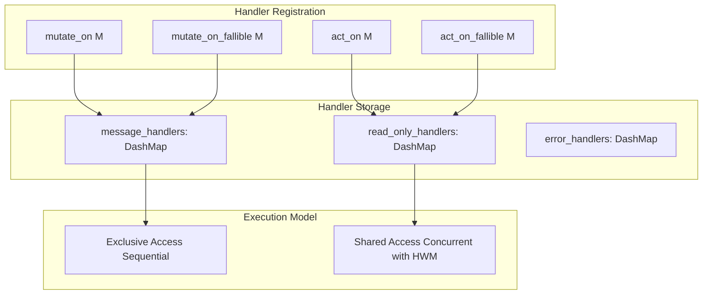
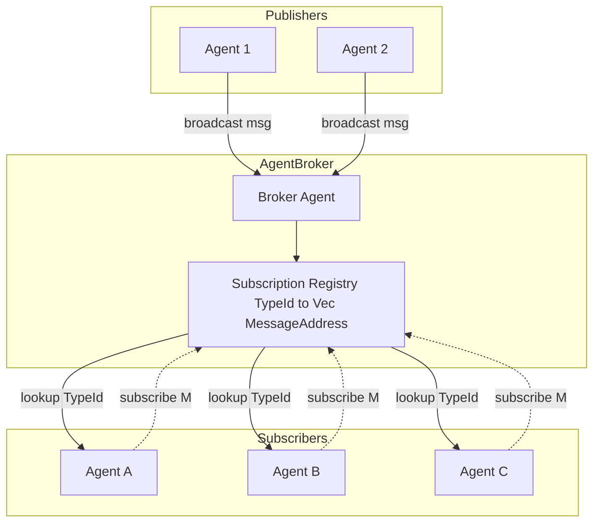
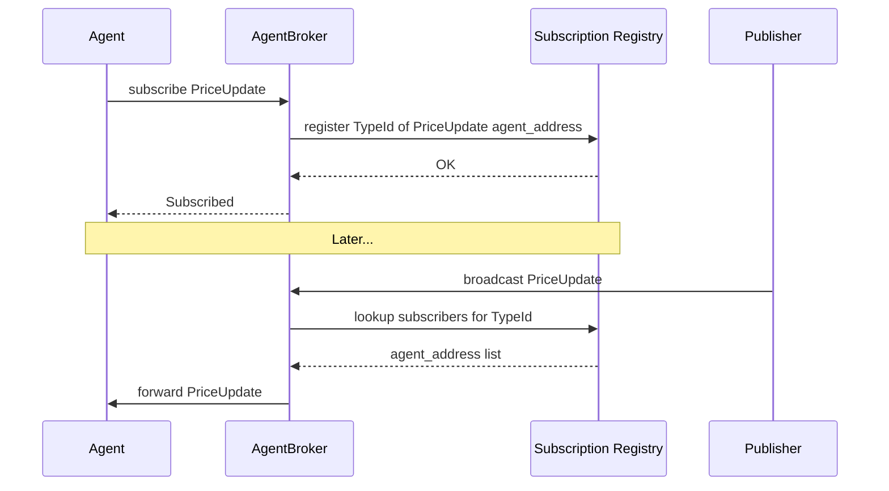
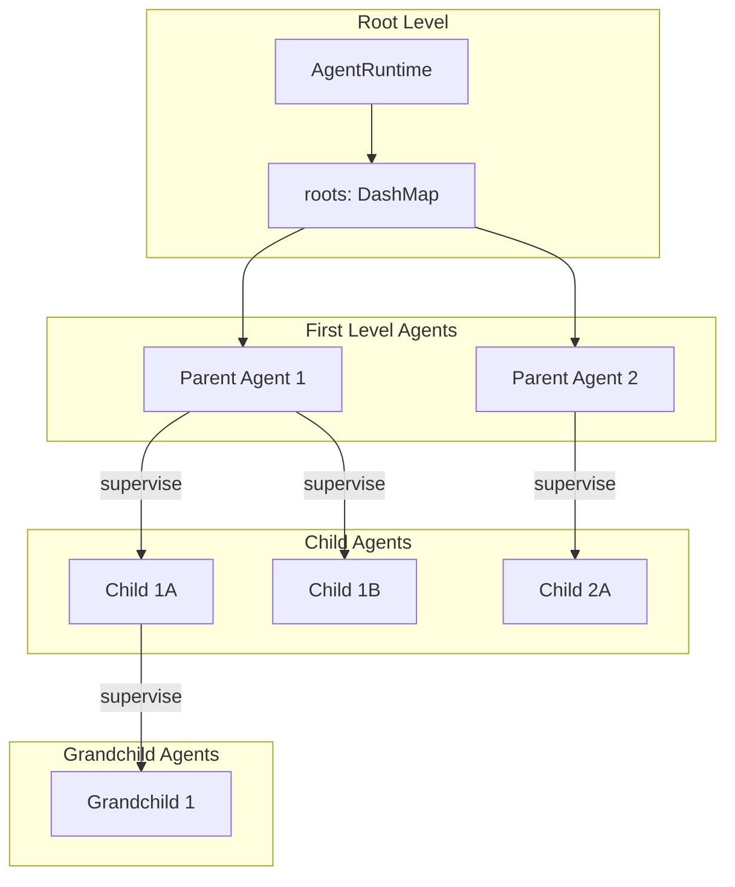
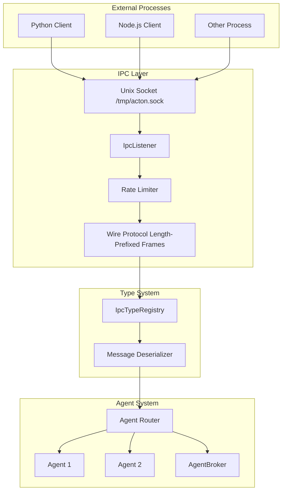
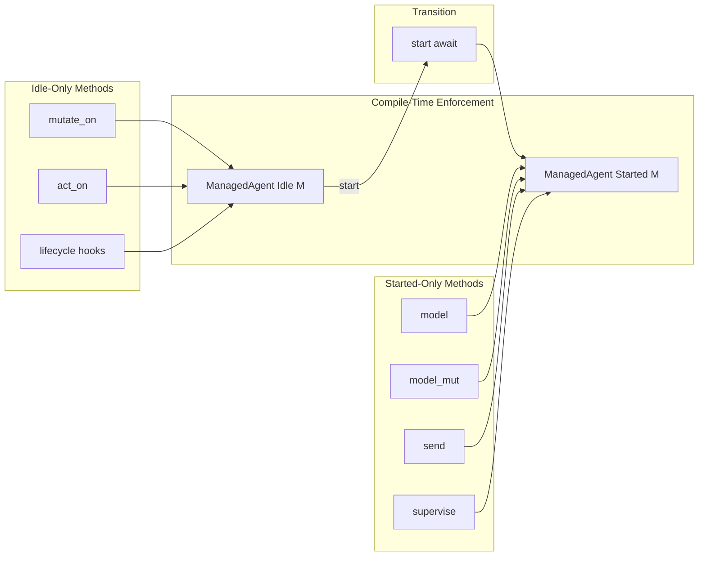
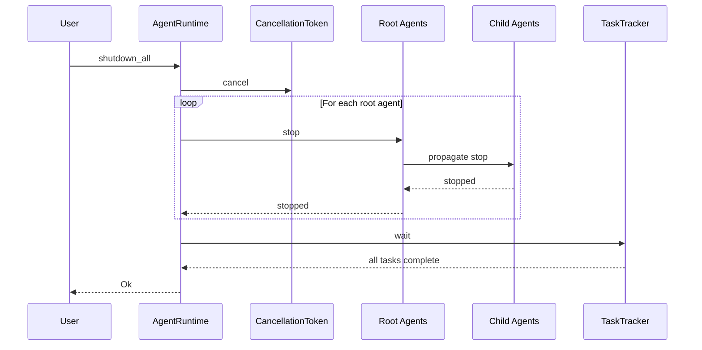

This document provides comprehensive architectural documentation for the `acton-reactive` crate, including system diagrams, component relationships, and design patterns.

---

## High-Level Architecture



### Core Components

| Component | Responsibility |
|-----------|----------------|
| **ActonApp** | Entry point; initializes the runtime |
| **AgentRuntime** | Manages agent lifecycle and system state |
| **AgentBroker** | Central pub/sub message broker |
| **ManagedAgent** | Individual agent with state and handlers |
| **AgentHandle** | External reference for agent interaction |

---

## Module Structure



### Directory Layout

```text
acton-reactive/src/
├── lib.rs                    # Public API & prelude
├── actor/
│   ├── mod.rs
│   ├── managed_agent.rs      # Core ManagedAgent type
│   ├── agent_config.rs       # AgentConfig builder
│   └── managed_agent/
│       ├── idle.rs           # Idle state methods
│       └── started.rs        # Started state methods
├── common/
│   ├── mod.rs
│   ├── acton.rs              # ActonApp entry point
│   ├── acton_inner.rs        # Internal runtime state
│   ├── agent_runtime.rs      # AgentRuntime
│   ├── agent_handle.rs       # AgentHandle
│   ├── agent_broker.rs       # AgentBroker
│   ├── agent_reply.rs        # AgentReply utility
│   ├── config.rs             # ActonConfig
│   ├── types.rs              # Internal type aliases
│   └── ipc/                  # IPC module (feature-gated)
│       ├── mod.rs
│       ├── config.rs
│       ├── listener.rs
│       ├── protocol.rs
│       ├── registry.rs
│       ├── types.rs
│       ├── rate_limiter.rs
│       └── subscription_manager.rs
├── message/
│   ├── mod.rs
│   ├── envelope.rs           # Internal Envelope
│   ├── outbound_envelope.rs  # OutboundEnvelope
│   ├── message_address.rs    # MessageAddress
│   ├── message_context.rs    # MessageContext<M>
│   ├── broker_request.rs     # BrokerRequest
│   ├── broker_request_envelope.rs
│   ├── signal.rs             # SystemSignal
│   ├── message_error.rs      # MessageError
│   ├── subscribe_broker.rs   # SubscribeBroker
│   └── unsubscribe_broker.rs # UnsubscribeBroker
└── traits/
    ├── mod.rs
    ├── acton_message.rs      # ActonMessage trait
    ├── acton_message_reply.rs
    ├── agent_handle_interface.rs
    ├── broker.rs             # Broker trait
    ├── subscriber.rs         # Subscriber trait
    └── subscribable.rs       # Subscribable trait
```

---

## Agent Lifecycle



### Lifecycle Hooks

```mermaid
sequenceDiagram
    participant User
    participant Agent as ManagedAgent
    participant Runtime as Tokio Runtime
    participant Loop as Message Loop

    User->>Agent: start await
    Agent->>Runtime: spawn task
    Runtime->>Agent: before_start
    Agent->>Loop: Enter message loop
    Runtime->>Agent: after_start

    Note over Loop: Processing messages...

    User->>Agent: stop
    Loop->>Agent: Exit message loop
    Runtime->>Agent: before_stop
    Runtime->>Agent: Close channels
    Runtime->>Agent: after_stop
    Agent->>User: Agent stopped
```

---

## Message Flow

### Direct Messaging


### Handler Types



---

## Pub/Sub Architecture



### Subscription Flow



---

## Supervision Hierarchy



### ERN Hierarchy

```text
root_service/                    # Root agent ERN
├── root_service/worker_1        # Child agent ERN
├── root_service/worker_2        # Child agent ERN
│   └── root_service/worker_2/validator   # Grandchild ERN
└── root_service/worker_3        # Child agent ERN
```

---

## IPC Architecture



---

## Design Patterns

### Type-State Pattern



---

## Key Architectural Decisions

### 1. Type-State for Lifecycle Safety

The use of phantom type parameters (`Idle`/`Started`) ensures that configuration methods are only available before an agent starts, and runtime methods are only available after. This prevents entire classes of bugs at compile time.

### 2. Arc-Based Message Sharing

Messages are wrapped in `Arc<dyn ActonMessage>` for efficient broadcast distribution. When a message is broadcast to N subscribers, only one allocation occurs, and N Arc clones are created (cheap reference count increments).

### 3. Handler Concurrency Model

- **Mutable handlers** (`mutate_on`): Execute with exclusive access, one at a time
- **Read-only handlers** (`act_on`): Execute concurrently with high-water mark control

This allows maximum concurrency for read operations while maintaining safety for mutations.

### 4. Channel-Based Communication

All inter-agent communication uses Tokio MPSC channels, providing:
- Backpressure handling
- Non-blocking sends
- Proper ordering guarantees

### 5. XDG-Compliant Configuration

Configuration follows the XDG Base Directory Specification for cross-platform compatibility:
- Linux: `~/.config/acton/config.toml`
- macOS: `~/Library/Application Support/acton/config.toml`
- Windows: `%APPDATA%/acton/config.toml`

### 6. Feature-Gated IPC

IPC functionality is optional via feature flags, keeping the core library lean for applications that don't need external process communication.

---

## Runtime Initialization Sequence


---

## Shutdown Sequence


