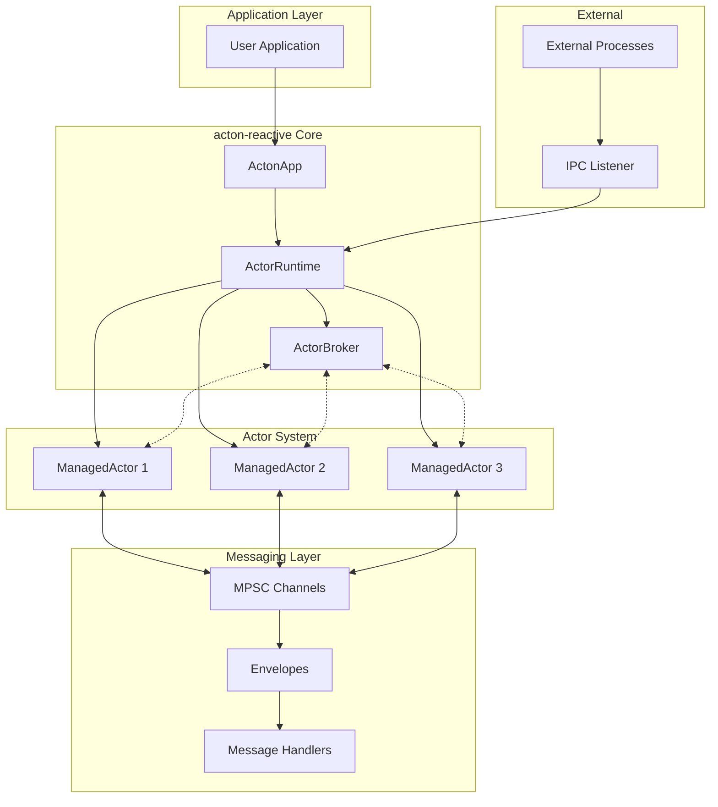
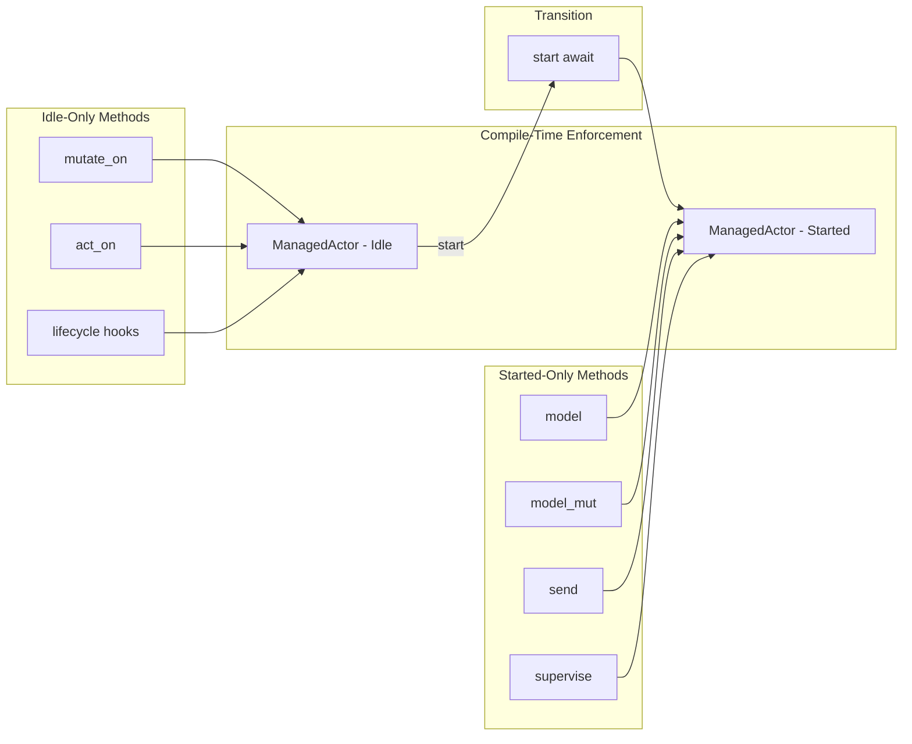
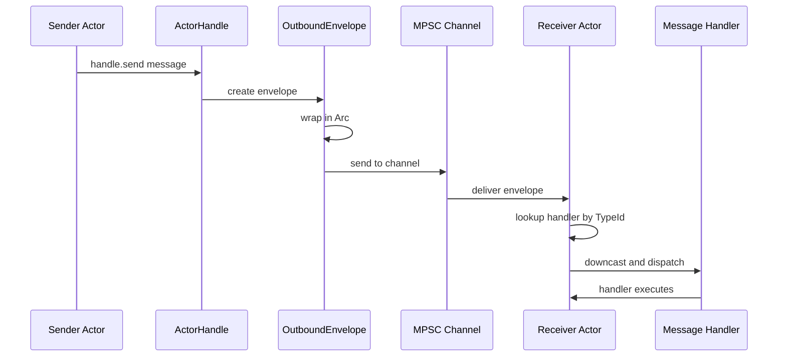
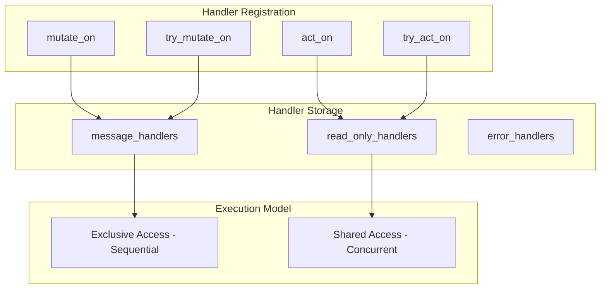
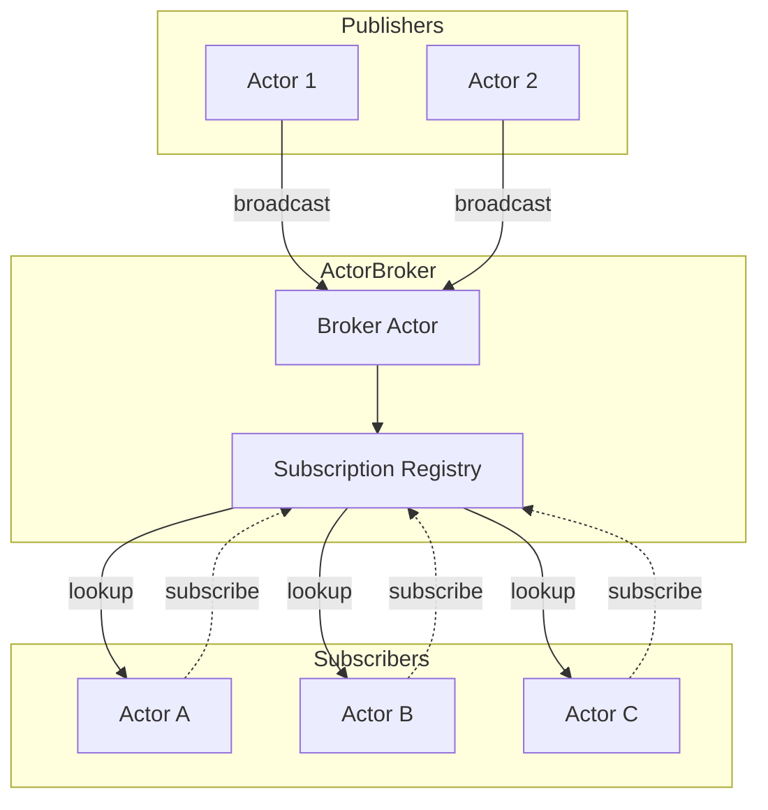
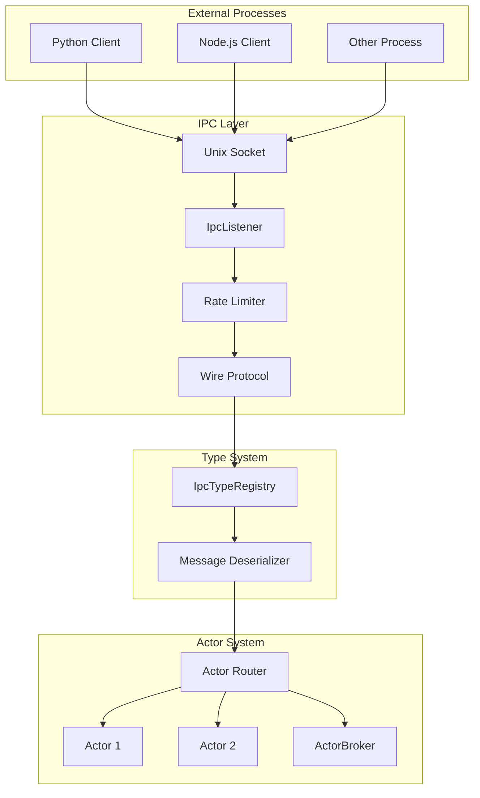
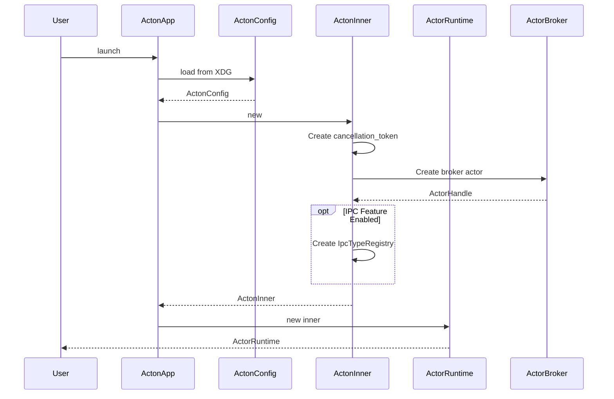
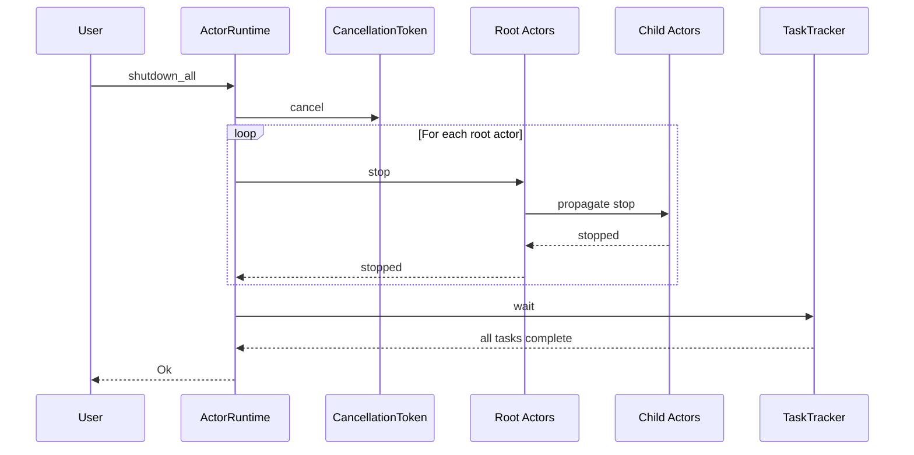

This page explains how `acton-reactive` works under the hood. You don't need to understand all of this to use the framework, but it helps when debugging or optimizing.

---

## The Big Picture

At a high level, `acton-reactive` is a system where **actors** (independent workers) communicate by passing **messages** through **channels**. A **runtime** manages everything, and a **broker** enables pub/sub messaging.

Think of it like this:

```text
┌─────────────────────────────────────────────────────────────────┐
│                        Your Application                          │
│                                                                   │
│  "I want actors that process data, talk to each other, and      │
│   react to events - without me worrying about threading."        │
│                                                                   │
└────────────────────────────────┬────────────────────────────────┘
                                 │
                                 ▼
┌─────────────────────────────────────────────────────────────────┐
│                        acton-reactive                            │
│                                                                   │
│  ActonApp → ActorRuntime → Actors ←→ Messages ←→ Broker          │
│                                                                   │
│  "I'll handle the channels, the concurrency, the lifecycle,     │
│   and the message routing. You just write handlers."             │
│                                                                   │
└────────────────────────────────┬────────────────────────────────┘
                                 │
                                 ▼
┌─────────────────────────────────────────────────────────────────┐
│                           Tokio                                   │
│                                                                   │
│  "I'll handle the actual async tasks, I/O, and scheduling."     │
│                                                                   │
└─────────────────────────────────────────────────────────────────┘
```

---

## System Architecture

Here's how the pieces connect:



### What Each Part Does

| Component | Role | Analogy |
|-----------|------|---------|
| **ActonApp** | Entry point - creates the runtime | The front door to your office building |
| **ActorRuntime** | Manages all actors and their lifecycles | HR department - hires, manages, retires workers |
| **ActorBroker** | Routes pub/sub messages to subscribers | The office bulletin board |
| **ManagedActor** | An individual actor with state and handlers | An employee at their desk |
| **ActorHandle** | A reference for sending messages to an actor | An employee's email address |
| **Channels** | Tokio MPSC channels for message delivery | The mail room |

---

## How an Actor Works

An actor goes through distinct phases, and what you can do with it depends on which phase it's in. This is enforced at compile time through Rust's type system.

### The Type-State Pattern



**What this means for you:**

- You can only register handlers *before* starting an actor
- You can only send messages *after* starting an actor
- If you try to do it wrong, the compiler stops you - no runtime surprises

### Actor Lifecycle

Here's what happens when you create and start an actor:


### Lifecycle Hook Timing

When exactly do the hooks run?

```mermaid
sequenceDiagram
    participant User
    participant Actor as ManagedActor
    participant Runtime as TokioRuntime
    participant Loop as MessageLoop

    User->>Actor: start await
    Actor->>Runtime: spawn task
    Runtime->>Actor: before_start
    Actor->>Loop: Enter message loop
    Runtime->>Actor: after_start

    Note over Loop: Processing messages

    User->>Actor: stop
    Loop->>Actor: Exit message loop
    Runtime->>Actor: before_stop
    Runtime->>Actor: Close channels
    Runtime->>Actor: after_stop
    Actor->>User: Actor stopped
```

**In plain English:**
1. You call `start().await`
2. `before_start` runs (good for loading config, opening connections)
3. The message loop starts
4. `after_start` runs (good for sending initial messages)
5. *...actor processes messages...*
6. Something calls `stop()` or the runtime shuts down
7. `before_stop` runs (good for cleanup, saving state)
8. The message loop ends
9. `after_stop` runs (good for final logging, assertions in tests)

---

## How Messages Flow

### Direct Messaging

When you call `handle.send(message)`, here's what happens:



**Key points:**
- Messages are wrapped in `Arc` for efficient cloning
- The receiver looks up the handler by message type (using `TypeId`)
- If no handler is registered for that message type, it's silently dropped

### Handler Execution Models

There are two ways handlers can execute, depending on which method you used to register them:



**The difference visualized:**

```text
mutate_on handlers (sequential):
┌─────────┐  ┌─────────┐  ┌─────────┐
│   M1    │→ │   M2    │→ │   M3    │
└─────────┘  └─────────┘  └─────────┘
   time →

act_on handlers (concurrent):
┌─────┬─────┬─────┐
│ M1  │ M2  │ M3  │  ← all at once
└─────┴─────┴─────┘
```

---

## Pub/Sub Architecture

The broker enables publish/subscribe messaging between actors:



### How Subscriptions Work

```mermaid
sequenceDiagram
    participant Actor
    participant Broker as ActorBroker
    participant Registry as Subscription Registry
    participant Publisher

    Actor->>Broker: subscribe PriceUpdate
    Broker->>Registry: register TypeId
    Registry-->>Broker: OK
    Broker-->>Actor: Subscribed

    Note over Actor,Registry: Later...

    Publisher->>Broker: broadcast PriceUpdate
    Broker->>Registry: lookup subscribers
    Registry-->>Broker: subscriber list
    Broker->>Actor: forward PriceUpdate
```

**Important:** Subscribe *before* starting the actor if you want to catch all broadcasts:

```rust
// Good - subscribe before start
actor.handle().subscribe::<MyEvent>().await;
let handle = actor.start().await;

// Risk - might miss early broadcasts
let handle = actor.start().await;
handle.subscribe::<MyEvent>().await;  // Could miss messages!
```

---

## Supervision (Parent-Child Actors)

Actors can create and supervise child actors. When a parent stops, all children stop automatically.


**ERN (Entity Resource Names)** reflect this hierarchy:

```text
root_service/                    # Root actor
├── root_service/worker_1        # Child
├── root_service/worker_2        # Child
│   └── root_service/worker_2/validator   # Grandchild
└── root_service/worker_3        # Child
```

---

## IPC Architecture

When the `ipc` feature is enabled, external processes can talk to actors:



See the [IPC Communication](/docs/ipc) guide for details.

---

## Key Design Decisions

These aren't just implementation details - they're intentional choices that affect how you use the framework.

### 1. Type-State for Lifecycle Safety

The `Idle`/`Started` type parameters mean you literally can't call the wrong methods at the wrong time. This catches bugs at compile time instead of runtime.

**Trade-off:** Slightly more complex types, but impossible to misuse.

### 2. Arc-Based Message Sharing

Messages are wrapped in `Arc<dyn ActonMessage>`. When you broadcast to N subscribers, only one allocation happens.

**Trade-off:** Small overhead for direct messages, big win for broadcasts.

### 3. Mutable vs Read-Only Handlers

`mutate_on` runs sequentially (one at a time). `act_on` runs concurrently (many at once).

**Trade-off:** You have to think about which one to use, but you get explicit control over concurrency.

### 4. Channel-Based Communication

All actor communication goes through Tokio MPSC channels.

**Benefits:**
- Automatic backpressure (slow consumers don't break fast producers)
- Non-blocking sends
- Guaranteed ordering within a single channel

### 5. XDG-Compliant Configuration

Config files live in standard locations:
- Linux: `~/.config/acton/config.toml`
- macOS: `~/Library/Application Support/acton/config.toml`
- Windows: `%APPDATA%/acton/config.toml`

**Benefit:** No surprises about where config lives.

### 6. Feature-Gated IPC

IPC is optional. If you don't need it, you don't pay for it (compile time or binary size).

---

## Module Structure

For contributors or those who want to understand the codebase:

```text
acton-reactive/src/
├── lib.rs                    # Public API & prelude
├── actor/
│   ├── mod.rs
│   ├── managed_actor.rs      # Core ManagedActor type
│   ├── actor_config.rs       # ActorConfig builder
│   └── managed_actor/
│       ├── idle.rs           # Idle state methods
│       └── started.rs        # Started state methods
├── common/
│   ├── mod.rs
│   ├── acton.rs              # ActonApp entry point
│   ├── acton_inner.rs        # Internal runtime state
│   ├── actor_runtime.rs      # ActorRuntime
│   ├── actor_handle.rs       # ActorHandle
│   ├── actor_broker.rs       # ActorBroker
│   ├── actor_reply.rs        # Reply utility
│   ├── config.rs             # ActonConfig
│   └── ipc/                   # IPC module (feature-gated)
├── message/
│   ├── mod.rs
│   ├── envelope.rs           # Internal Envelope
│   ├── outbound_envelope.rs  # OutboundEnvelope
│   ├── message_context.rs    # MessageContext<M>
│   └── ...
└── traits/
    ├── mod.rs
    ├── acton_message.rs      # ActonMessage trait
    └── ...
```

---

## Runtime Startup Sequence

What happens when you call `ActonApp::launch()`:



---

## Shutdown Sequence

What happens when you call `runtime.shutdown_all()`:



**Key behavior:** Stopping propagates down the supervision tree. Children stop before parents finish stopping.
