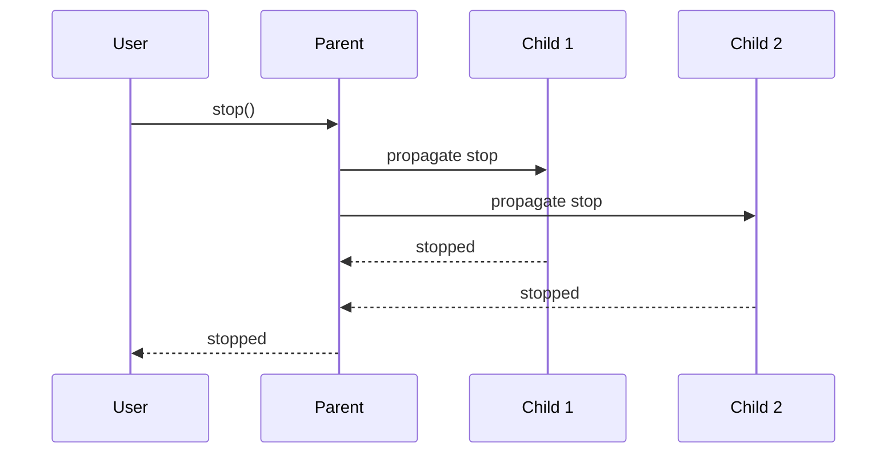

This page covers practical patterns for working with parent-child actors. For foundational concepts, see [Supervision Basics](/docs/core-concepts/supervision-basics).

---

## Quick Recap: The Supervision Pattern

Parent-child relationships are created using `supervise()`:

```rust
let mut runtime = ActonApp::launch_async().await;

// Create and start the parent
let parent = runtime.new_actor::<Supervisor>();
let parent_handle = parent.start().await;

// Create and configure the child
let mut child = runtime.new_actor::<Worker>();
child.mutate_on::<Task>(|actor, ctx| {
    actor.model.task_count += 1;
    Reply::ready()
});

// Parent supervises child (starts it and registers the relationship)
let child_handle = parent_handle.supervise(child).await?;
```

Key points:
- Create children with `runtime.new_actor()`
- Configure handlers before supervision
- `supervise()` starts the child and returns its handle
- When the parent stops, all children stop automatically

---

## Worker Pool Pattern

A supervisor managing multiple workers is one of the most common patterns:

```rust
use acton_reactive::prelude::*;

#[acton_actor]
struct Supervisor {
    workers: Vec<ActorHandle>,
}

#[acton_actor]
struct Worker {
    task_count: u32,
}

#[acton_message]
struct Task { id: u32 }

#[acton_main]
async fn main() -> anyhow::Result<()> {
    let mut runtime = ActonApp::launch_async().await;

    // Create supervisor
    let supervisor = runtime.new_actor::<Supervisor>();
    let supervisor_handle = supervisor.start().await;

    // Create worker pool
    let mut worker_handles = Vec::new();
    for i in 0..3 {
        let config = ActorConfig::new(
            Ern::with_root(format!("worker-{i}")).unwrap(),
            None,
            None
        )?;

        let mut worker = runtime.new_actor_with_config::<Worker>(config);
        worker.mutate_on::<Task>(|actor, ctx| {
            let task = ctx.message();
            actor.model.task_count += 1;
            println!("Worker processing task {}", task.id);
            Reply::ready()
        });

        let handle = supervisor_handle.supervise(worker).await?;
        worker_handles.push(handle);
    }

    // Distribute work round-robin
    for i in 0..9 {
        let worker = &worker_handles[i % 3];
        worker.send(Task { id: i as u32 }).await;
    }

    tokio::time::sleep(tokio::time::Duration::from_millis(100)).await;
    runtime.shutdown_all().await?;
    Ok(())
}
```

Each worker processes its assigned tasks. The supervisor has three children that stop automatically when the supervisor stops.

---

## Communication Patterns

### Parent to Child

After supervising a child, use the returned handle to send messages:

```rust
// Store handles for later use
let mut workers: Vec<ActorHandle> = Vec::new();

for i in 0..3 {
    let mut worker = runtime.new_actor::<Worker>();
    // ... configure handlers ...
    let handle = supervisor_handle.supervise(worker).await?;
    workers.push(handle);
}

// Send work to children
for worker in &workers {
    worker.send(Task { id: 1 }).await;
}
```

### Child to Parent

Children can report back to their parent using stored handles or reply envelopes.

**Option 1: Store parent handle in child state**

```rust
#[acton_actor]
struct Child {
    parent_handle: Option<ActorHandle>,
}

#[acton_message]
struct SetParent(ActorHandle);

#[acton_message]
struct TaskComplete { id: u32 }

// Give child the parent's handle after creation
child_handle.send(SetParent(parent_handle.clone())).await;

// Child can now report back in any handler
child.mutate_on::<DoWork>(|actor, ctx| {
    let parent = actor.model.parent_handle.clone();
    let task_id = ctx.message().id;

    Reply::pending(async move {
        // Do work...
        if let Some(parent) = parent {
            parent.send(TaskComplete { id: task_id }).await;
        }
    })
});
```

**Option 2: Use reply envelopes for request-response**

```rust
child.act_on::<DoWork>(|_actor, ctx| {
    let reply = ctx.reply_envelope();

    Reply::pending(async move {
        // Do work...
        reply.send(WorkComplete).await;
    })
});
```

For more on request-response patterns, see [Request-Response](/docs/building-apps/request-response).

---

## Finding Children

Parents can look up their children programmatically:

```rust
// Get all children
let children = supervisor_handle.children();
println!("Supervisor has {} children", children.len());

// Find a specific child by ID
if let Some(child) = supervisor_handle.find_child(&child_id) {
    child.send(Task { id: 1 }).await;
}

// Iterate over children
for entry in supervisor_handle.children().iter() {
    let child_id = entry.key();
    let child_handle = entry.value();
    println!("Child: {}", child_id);
}
```

---

## Lifecycle Hooks for Children

Children have their own lifecycle hooks that work exactly like root actors:

```rust
let mut child = runtime.new_actor::<ChildState>();

child
    .after_start(|actor| {
        println!("Child {} started", actor.id());
        Reply::ready()
    })
    .after_stop(|actor| {
        println!("Child {} stopped", actor.id());
        Reply::ready()
    });

let child_handle = parent_handle.supervise(child).await?;
```

This is useful for:
- Initializing child-specific resources
- Logging child lifecycle events
- Test assertions about child behavior

---

## Cascading Shutdown

When a parent stops, all children stop first (depth-first):



This means:
- Children's `before_stop` and `after_stop` hooks run before the parent completes
- Resources are cleaned up in reverse order of creation
- No manual cleanup tracking needed

---

## Best Practices

### Keep Hierarchies Shallow

```
# Prefer flat structures
supervisor/
├── worker-1
├── worker-2
└── worker-3

# Avoid deep nesting unless necessary
supervisor/
└── manager/
    └── sub-manager/
        └── worker
```

### Use Meaningful Names

```rust
let config = ActorConfig::new(
    Ern::with_root("order-processor").unwrap(),
    None,
    None
)?;
let processor = runtime.new_actor_with_config::<Processor>(config);
```

This creates clear ERN paths like `order-processor/validator`.

### Store Handles When Needed

If you need to communicate with children later, store their handles:

```rust
#[acton_actor]
struct Supervisor {
    workers: Vec<ActorHandle>,
}
```

If you only need parent-to-child communication at creation time, you can discard the handles.

---

## Next

[Request-Response](/docs/building-apps/request-response) — Getting responses from actors
