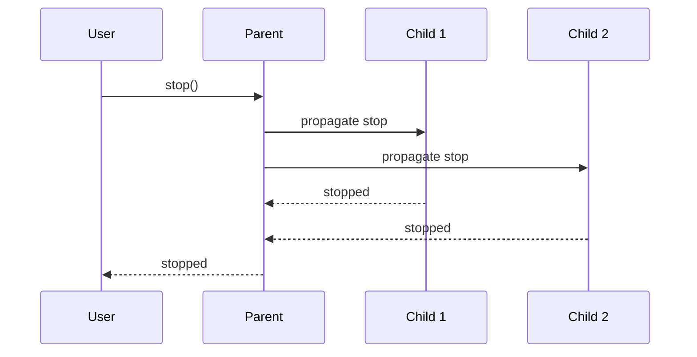

This page covers practical patterns for working with parent-child actors. For foundational concepts, see [Supervision Basics](/docs/core-concepts/supervision-basics).

---

## Quick Recap: The Supervision Pattern

A supervised child is registered with `supervise_with`, which takes a config naming the child and its parent, plus a **blueprint** describing how to build it:

```rust
let mut runtime = ActonApp::launch_async().await;

// Create and start the parent
let parent = runtime.new_actor::<Supervisor>();
let parent_handle = parent.start().await;

let config = ActorConfig::for_supervised_child("worker", parent_handle.clone(), None)?;

let child = parent_handle
    .supervise_with::<Worker>(&runtime, config, |actor| {
        // The blueprint. Replayed on every start, including every restart.
        actor.mutate_on::<Task>(|actor, ctx| {
            actor.model.task_count += 1;
            Reply::ready()
        });
    })
    .await?;
```

Key points:
- `for_supervised_child` gives the child a hierarchical identifier (`parent/worker`) and lets it notify its parent when it terminates
- The blueprint is what the framework replays to **restart** the child
- `supervise_with` returns a `SupervisedChild`, which always names the incarnation currently running
- When the parent stops, all children stop automatically, reporting `TerminationReason::ParentShutdown`


`supervise_with` awaits the child's start, so calling it from a `mutate_on` handler would stall the supervisor's message loop. `supervise_deferred` records the child and queues its start for the loop's next turn, returning the `SupervisedChild` synchronously.


The older `supervise(child)` still exists and still works. It adopts an already-built actor for cascading shutdown, but the supervisor holds no blueprint for it, so **a child registered that way is never restarted.**

---

## Worker Pool Pattern

A supervisor managing multiple workers is one of the most common patterns:

```rust
use acton_reactive::prelude::*;

#[acton_actor]
struct Supervisor {
    workers: Vec<SupervisedChild>,
}

#[acton_actor]
struct Worker {
    task_count: u32,
}

#[acton_message]
struct Task { id: u32 }

#[acton_message]
struct GetTaskCount;

#[acton_message]
struct TaskCount(u32);

impl Request for GetTaskCount {
    type Response = TaskCount;
}

#[acton_main]
async fn main() -> anyhow::Result<()> {
    let mut runtime = ActonApp::launch_async().await;

    // Create supervisor
    let supervisor = runtime.new_actor::<Supervisor>();
    let supervisor_handle = supervisor.start().await;

    // Create worker pool
    let mut workers = Vec::new();
    for i in 0..3 {
        let config = ActorConfig::for_supervised_child(
            format!("worker-{i}"),
            supervisor_handle.clone(),
            None,
        )?
        .with_restart_policy(RestartPolicy::Permanent);

        workers.push(
            supervisor_handle
                .supervise_with::<Worker>(&runtime, config, |actor| {
                    actor
                        .mutate_on::<Task>(|actor, ctx| {
                            let task = ctx.message();
                            actor.model.task_count += 1;
                            println!("Worker processing task {}", task.id);
                            Reply::ready()
                        })
                        .act_on::<GetTaskCount>(|actor, ctx| {
                            let count = actor.model.task_count;
                            let reply = ctx.reply_envelope();
                            Reply::pending(async move {
                                reply.send(TaskCount(count)).await;
                            })
                        });
                })
                .await?,
        );
    }

    // Distribute work round-robin. `current()` names the incarnation running
    // right now, which is the point of holding a SupervisedChild.
    for i in 0..9u32 {
        workers[i as usize % 3].current()?.send(Task { id: i }).await;
    }

    // No sleep: a reply proves that worker has worked through its queue,
    // because inboxes are FIFO.
    for worker in &workers {
        let count = worker.current()?.ask(GetTaskCount).await?;
        println!("Worker handled {} tasks", count.0);
    }

    runtime.shutdown_all().await?;
    Ok(())
}
```

Each worker processes its assigned tasks, and each is restarted from its blueprint if it dies. The supervisor has three children that stop automatically when the supervisor stops.

---

## Communication Patterns

### Parent to Child

Store the `SupervisedChild`, and resolve it to a handle at the point of use:

```rust
// Store the supervised references, not the handles.
let mut workers: Vec<SupervisedChild> = Vec::new();

for i in 0..3 {
    let config = ActorConfig::for_supervised_child(
        format!("worker-{i}"),
        supervisor_handle.clone(),
        None,
    )?;
    workers.push(
        supervisor_handle
            .supervise_with::<Worker>(&runtime, config, blueprint.clone())
            .await?,
    );
}

// Send work to children
for worker in &workers {
    worker.current()?.send(Task { id: 1 }).await;
}
```


An `ActorHandle` names **one incarnation**. When the child restarts, that handle goes stale and sends land in a mailbox nobody is reading, with no error. `SupervisedChild::current()` always resolves to the incarnation running now.

If the child might still be starting or backing off, `wait_running().await` blocks until it is up.


### Child to Parent

Children can report back to their parent using stored handles or reply envelopes.

**Option 1: Store parent handle in child state**

```rust
#[acton_actor]
struct Child {
    parent_handle: Option<ActorHandle>,
}

#[acton_message]
struct SetParent(ActorHandle);

#[acton_message]
struct TaskComplete { id: u32 }

// Give child the parent's handle after creation
child_handle.send(SetParent(parent_handle.clone())).await;

// Child can now report back in any handler
child.mutate_on::<DoWork>(|actor, ctx| {
    let parent = actor.model.parent_handle.clone();
    let task_id = ctx.message().id;

    Reply::pending(async move {
        // Do work...
        if let Some(parent) = parent {
            parent.send(TaskComplete { id: task_id }).await;
        }
    })
});
```

**Option 2: Use reply envelopes for request-response**

```rust
child.act_on::<DoWork>(|_actor, ctx| {
    let reply = ctx.reply_envelope();

    Reply::pending(async move {
        // Do work...
        reply.send(WorkComplete).await;
    })
});
```

For more on request-response patterns, see [Request-Response](/docs/building-apps/request-response).

---

## Finding Children

Parents can look up their children programmatically:

```rust
// Get all children
let children = supervisor_handle.children();
println!("Supervisor has {} children", children.len());

// Find a specific child by ID
if let Some(child) = supervisor_handle.find_child(&child_id) {
    child.send(Task { id: 1 }).await;
}

// Iterate over children
for entry in supervisor_handle.children().iter() {
    let child_id = entry.key();
    let child_handle = entry.value();
    println!("Child: {}", child_id);
}
```

---

## Lifecycle Hooks for Children

Children have their own lifecycle hooks that work exactly like root actors:

```rust
let child = parent_handle
    .supervise_with::<ChildState>(&runtime, config, |actor| {
        actor
            .after_start(|actor| {
                println!("Child {} started", actor.id());
                Reply::ready()
            })
            .after_stop(|actor| {
                println!("Child {} stopped", actor.id());
                Reply::ready()
            });
    })
    .await?;
```

Hooks go in the blueprint, so they run on every incarnation rather than only the first.

This is useful for:
- Initializing child-specific resources
- Logging child lifecycle events
- Test assertions about child behavior


A hook returning `Reply::pending` has its future run **alongside** the message loop, so the actor can take messages before initialization finishes. "Started" does not imply "initialized".

If callers must not see the actor until it is ready, have the handler hold `ctx.reply_envelope()` in the model and answer once initialization completes. See [Actor Lifecycle](/docs/actor-lifecycle).


---

## Cascading Shutdown

When a parent stops, all children stop first (depth-first):


```mermaid
sequenceDiagram
    participant U as User
    participant P as Parent
    participant C1 as Child 1
    participant C2 as Child 2

    U->>P: stop()
    P->>C1: propagate stop
    P->>C2: propagate stop
    C1-->>P: stopped
    C2-->>P: stopped
    P-->>U: stopped
```

This means:
- Children's `before_stop` and `after_stop` hooks run before the parent completes
- Siblings stop concurrently; each child's own children stop before it does (depth-first)
- No manual cleanup tracking needed

---

## Best Practices

### Keep Hierarchies Shallow

```
# Prefer flat structures
supervisor/
├── worker-1
├── worker-2
└── worker-3

# Avoid deep nesting unless necessary
supervisor/
└── manager/
    └── sub-manager/
        └── worker
```

### Use Meaningful Names

```rust
let config = ActorConfig::new(Ern::with_root("order-processor")?, None);
let processor = runtime.new_actor_with_config::<Processor>(config);
```

A child of that actor is named beneath it, giving clear ERN paths like `order-processor/validator`. That path is also the name the child is reachable under over IPC.

A supervision chain is limited to `MAX_SUPERVISION_DEPTH` (10) levels, which is another reason to keep hierarchies shallow.

### Store Handles When Needed

If you need to communicate with children later, store their handles:

```rust
#[acton_actor]
struct Supervisor {
    workers: Vec<SupervisedChild>,
}
```

If you only need parent-to-child communication at creation time, you can discard them.

---

## Next

[Request-Response](/docs/building-apps/request-response) — Getting responses from actors
