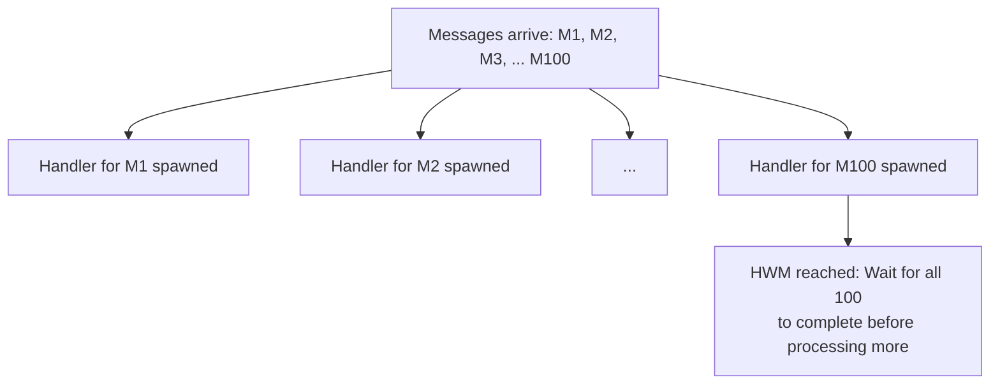

This guide covers all configuration options available in `acton-reactive`, including file locations, TOML format, and runtime customization.

---

## Configuration File Locations

`acton-reactive` follows the XDG Base Directory Specification for configuration file locations.

### Search Order

The framework searches for `config.toml` in these locations (in order):

| Platform | Primary Location | Fallback |
|----------|-----------------|----------|
| Linux | `$XDG_CONFIG_HOME/acton/config.toml` | `~/.config/acton/config.toml` |
| macOS | `$XDG_CONFIG_HOME/acton/config.toml` | `~/Library/Application Support/acton/config.toml` |
| Windows | `%APPDATA%/acton/config.toml` | - |

### Behavior

- If no configuration file is found, default values are used
- If a configuration file exists but is malformed, an error is logged and defaults are used
- Configuration is loaded once at startup and cached globally

---

## Configuration Sections

### Timeouts

Control various timeout behaviors (all values in **milliseconds**).

```toml
[timeouts]
# Timeout for individual actor shutdown
actor_shutdown = 10000      # 10 seconds

# Timeout for entire system shutdown
system_shutdown = 30000     # 30 seconds

# Maximum wait before flushing concurrent read-only handlers
read_only_handler_flush = 10  # 10 milliseconds
```

| Option | Type | Default | Description |
|--------|------|---------|-------------|
| `actor_shutdown` | `u64` | `10000` | Maximum time to wait for a single actor to stop gracefully |
| `system_shutdown` | `u64` | `30000` | Maximum time to wait for the entire system to shutdown |
| `read_only_handler_flush` | `u64` | `10` | Timeout before forcing a flush of pending read-only handlers |

---

### Limits

Control capacity and resource limits.

```toml
[limits]
# Maximum concurrent read-only handlers before forced flush
concurrent_handlers_high_water_mark = 100

# MPSC channel buffer size for actor message inboxes
actor_inbox_capacity = 512

# Size for dummy/placeholder channels
dummy_channel_size = 1
```

| Option | Type | Default | Description |
|--------|------|---------|-------------|
| `concurrent_handlers_high_water_mark` | `usize` | `100` | Maximum number of concurrent `act_on` handlers before they're flushed |
| `actor_inbox_capacity` | `usize` | `512` | Buffer size for actor message queues (backpressure threshold) |
| `dummy_channel_size` | `usize` | `1` | Size for internal placeholder channels |

#### Understanding Handler Limits

Read-only handlers (`act_on`) can execute concurrently. The `concurrent_handlers_high_water_mark` prevents unbounded concurrency:



---

### Defaults

Default values used when creating actors.

```toml
[defaults]
# Default actor name when none provided
actor_name = "actor"

# Default root ERN identifier
root_ern = "default"
```

| Option | Type | Default | Description |
|--------|------|---------|-------------|
| `actor_name` | `String` | `"actor"` | Name assigned when `new_actor()` is called without a name |
| `root_ern` | `String` | `"default"` | Base identifier for the root namespace |

---

### Tracing

Configure logging and tracing levels.

```toml
[tracing]
# Verbosity settings (used by tracing-subscriber)
debug = "debug"
trace = "trace"
info = "info"
```

| Option | Type | Default | Description |
|--------|------|---------|-------------|
| `debug` | `String` | `"debug"` | Debug level filter string |
| `trace` | `String` | `"trace"` | Trace level filter string |
| `info` | `String` | `"info"` | Info level filter string |

---

### Paths

Directory paths for various file storage needs.

```toml
[paths]
# Log file directory
logs = "~/.local/share/acton/logs"

# Cache directory
cache = "~/.cache/acton"

# Data storage directory
data = "~/.local/share/acton"

# Configuration directory
config = "~/.config/acton"
```

| Option | Type | Default | Description |
|--------|------|---------|-------------|
| `logs` | `String` | `~/.local/share/acton/logs` | Directory for log files |
| `cache` | `String` | `~/.cache/acton` | Directory for cached data |
| `data` | `String` | `~/.local/share/acton` | Directory for persistent data |
| `config` | `String` | `~/.config/acton` | Directory for configuration |

---

### Behavior

Toggle behavioral features on/off.

```toml
[behavior]
# Enable structured tracing output
enable_tracing = true

# Enable metrics collection
enable_metrics = false
```

| Option | Type | Default | Description |
|--------|------|---------|-------------|
| `enable_tracing` | `bool` | `true` | Enable structured logging via `tracing` |
| `enable_metrics` | `bool` | `false` | Enable metrics collection (when implemented) |

---

## Complete Reference

### All Configuration Options

```toml
# acton-reactive Configuration
# Place this file at: ~/.config/acton/config.toml

[timeouts]
actor_shutdown = 10000           # ms - Individual actor shutdown timeout
system_shutdown = 30000          # ms - System-wide shutdown timeout
read_only_handler_flush = 10     # ms - Read-only handler flush timeout

[limits]
concurrent_handlers_high_water_mark = 100  # Max concurrent act_on handlers
actor_inbox_capacity = 512                  # Actor message queue size
dummy_channel_size = 1                      # Placeholder channel size

[defaults]
actor_name = "actor"             # Default actor name
root_ern = "default"             # Default root ERN

[tracing]
debug = "debug"
trace = "trace"
info = "info"

[paths]
logs = "~/.local/share/acton/logs"
cache = "~/.cache/acton"
data = "~/.local/share/acton"
config = "~/.config/acton"

[behavior]
enable_tracing = true
enable_metrics = false
```

---

## Example Configurations

### Development Configuration

Optimized for development with more verbose logging and shorter timeouts:

```toml
# ~/.config/acton/config.toml (Development)

[timeouts]
actor_shutdown = 5000            # 5 seconds - fail fast
system_shutdown = 10000          # 10 seconds
read_only_handler_flush = 5      # Faster flush

[limits]
concurrent_handlers_high_water_mark = 50   # Lower for debugging
actor_inbox_capacity = 100                  # Smaller queues
dummy_channel_size = 1

[tracing]
debug = "debug"
trace = "trace"
info = "info"

[behavior]
enable_tracing = true
enable_metrics = true            # Enable for development insights
```

### Production Configuration

Optimized for production with higher capacity and longer timeouts:

```toml
# ~/.config/acton/config.toml (Production)
# (or set XDG_CONFIG_HOME to point elsewhere, e.g. /etc/acton)

[timeouts]
actor_shutdown = 30000           # 30 seconds - graceful shutdown
system_shutdown = 60000          # 60 seconds
read_only_handler_flush = 50     # More batching

[limits]
concurrent_handlers_high_water_mark = 500  # Higher throughput
actor_inbox_capacity = 1000                 # Larger buffers
dummy_channel_size = 1

[tracing]
debug = "warn"                   # Less verbose
trace = "error"
info = "info"

[paths]
logs = "/var/log/acton"
cache = "/var/cache/acton"
data = "/var/lib/acton"
config = "/etc/acton"

[behavior]
enable_tracing = true
enable_metrics = true
```

---

## Programmatic Access

### Accessing Configuration

Configuration is available via the global `CONFIG` static:

```rust
use acton_reactive::common::config::CONFIG;

fn example() {
    // Access timeout settings
    let shutdown_timeout = CONFIG.timeouts.system_shutdown;

    // Access limits
    let inbox_size = CONFIG.limits.actor_inbox_capacity;

    // Access as Duration
    let duration = CONFIG.system_shutdown_timeout();
}
```

### Configuration Loading

The configuration is loaded lazily on first access:

```rust
use acton_reactive::common::config::ActonConfig;

fn custom_load() {
    // Load manually (usually not needed)
    let config = ActonConfig::load();

    // Or use the global instance
    use acton_reactive::common::config::CONFIG;
    let _ = &*CONFIG; // Force load
}
```

---

## IPC Configuration

When the `ipc` feature is enabled, the IPC listener reads its own configuration from a **separate file**: `$XDG_CONFIG_HOME/acton/ipc.toml` (typically `~/.config/acton/ipc.toml`). If no file is found, defaults are used.

### ipc.toml Structure

```toml
[socket]
# Override the default socket path (optional).
# Default: $XDG_RUNTIME_DIR/acton/<app_name>/ipc.sock
# path = "/run/user/1000/acton/my_app/ipc.sock"
mode = 0o660             # Socket file permissions (Unix)
# app_name = "my_app"    # Defaults to the binary name

[limits]
max_connections = 100
max_message_size = 1048576   # 1 MiB
push_buffer_size = 100       # Buffered push notifications per connection

[rate_limit]
enabled = true               # Rate limiting is ON by default
requests_per_second = 100    # Token bucket refill rate, per connection
burst_size = 50              # Token bucket capacity

[timeouts]
request_timeout_ms = 30000
read_timeout_ms = 60000              # 0 = no timeout
write_timeout_ms = 30000
subscription_read_timeout_ms = 0     # 0 = no timeout (default for subscribers)

[shutdown]
drain_timeout_ms = 5000      # Max wait for in-flight requests on shutdown
```

### Default IPC Values

| Option | Default | Description |
|--------|---------|-------------|
| `socket.path` | `$XDG_RUNTIME_DIR/acton/<app_name>/ipc.sock` (falls back to `/tmp/acton/<app_name>/ipc.sock`) | Unix socket file path |
| `socket.mode` | `0o660` | Socket file permissions |
| `limits.max_connections` | `100` | Maximum simultaneous connections |
| `limits.max_message_size` | `1048576` (1 MiB) | Maximum message size in bytes |
| `limits.push_buffer_size` | `100` | Push notifications buffered per connection; overflow is dropped |
| `rate_limit.enabled` | `true` | Per-connection token-bucket rate limiting |
| `rate_limit.requests_per_second` | `100` | Sustained request rate |
| `rate_limit.burst_size` | `50` | Maximum burst above the sustained rate |
| `timeouts.request_timeout_ms` | `30000` | Per-request timeout |
| `timeouts.read_timeout_ms` | `60000` | Idle read timeout for connections without subscriptions; `0` disables it |
| `timeouts.write_timeout_ms` | `30000` | Write timeout |
| `timeouts.subscription_read_timeout_ms` | `0` | Read timeout for connections with active subscriptions; `0` (default) lets subscribers stay connected indefinitely |
| `shutdown.drain_timeout_ms` | `5000` | Time to wait for in-flight requests during shutdown |


For `read_timeout_ms` and `subscription_read_timeout_ms`, a value of `0` disables the timeout entirely. Subscription connections use `subscription_read_timeout_ms`; all other connections use `read_timeout_ms`.


### Configuring IPC Programmatically

Pass a custom `IpcConfig` to `start_ipc_listener_with_config`. Calling `start_ipc_listener()` instead loads `ipc.toml` (or defaults) automatically.

```rust
use acton_reactive::prelude::*;
use std::path::PathBuf;

#[cfg(feature = "ipc")]
async fn setup_ipc(runtime: &ActorRuntime) {
    let mut config = IpcConfig::load();  // start from ipc.toml / defaults
    config.socket.path = Some(PathBuf::from("/run/user/1000/myapp/acton.sock"));
    config.limits.max_connections = 50;
    config.timeouts.read = 0;  // no idle timeout

    let listener = runtime
        .start_ipc_listener_with_config(config)
        .await
        .expect("Failed to start IPC");
}
```

---

## Best Practices

### 1. Use Sensible Defaults

The default configuration works well for most use cases. Only override values when you have specific requirements.

### 2. Adjust Inbox Capacity Based on Load

```toml
# High-throughput scenarios
[limits]
actor_inbox_capacity = 1000

# Memory-constrained scenarios
[limits]
actor_inbox_capacity = 50
```

### 3. Set Appropriate Shutdown Timeouts

Consider your application's cleanup requirements:

```toml
[timeouts]
# Simple apps: shorter timeouts
actor_shutdown = 5000

# Complex apps with DB connections, file I/O: longer timeouts
actor_shutdown = 30000
```

### 4. Monitor High Water Mark

If you see frequent handler flushes in logs, consider increasing the limit:

```toml
[limits]
concurrent_handlers_high_water_mark = 200
```

### 5. Use Different Configs Per Environment

```shell
# Development
export XDG_CONFIG_HOME=./config/dev
cargo run

# Production
export XDG_CONFIG_HOME=/etc/myapp
./my-acton-app
```
