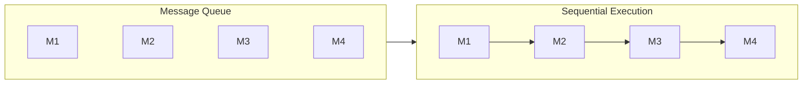
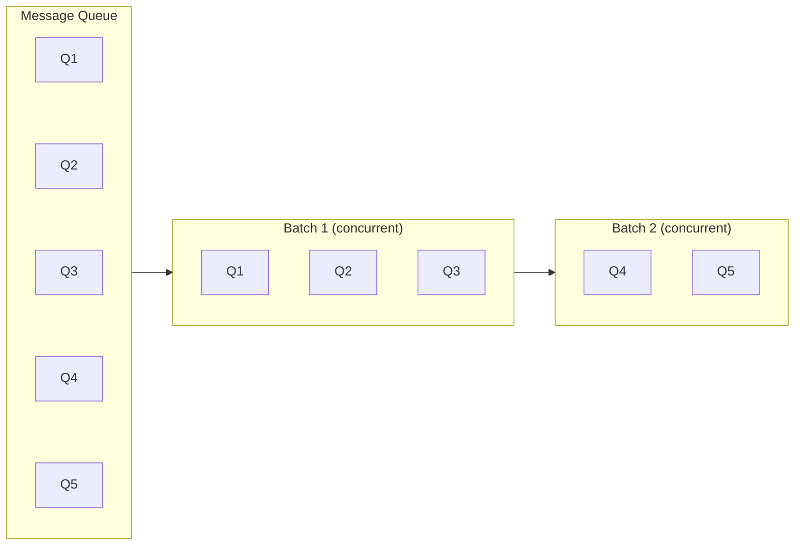
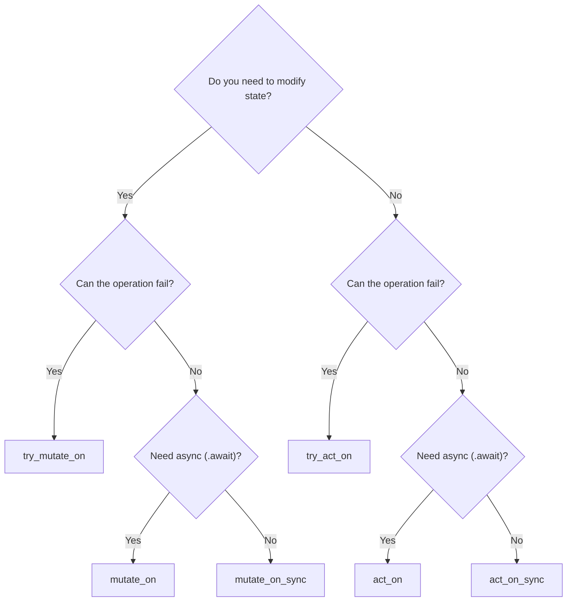

Acton provides six handler types to cover different combinations of state access, error handling, and async needs. Choosing the right one affects both correctness and performance.

---

## Quick Reference

| Handler | State Access | Can Fail | Concurrency | Async |
|---------|-------------|----------|-------------|-------|
| `mutate_on` | Mutable | No | Sequential | Yes |
| `mutate_on_sync` | Mutable | No | Sequential | No |
| `act_on` | Read-only | No | Concurrent | Yes |
| `act_on_sync` | Read-only | No | Concurrent | No |
| `try_mutate_on` | Mutable | Yes | Sequential | Yes |
| `try_act_on` | Read-only | Yes | Concurrent | Yes |

**Rule of thumb:** Start with `mutate_on`. Use `act_on` when you're sure the handler only reads. Add `try_` prefix when you need error handling. Use `_sync` variants when you don't need async to avoid a heap allocation per invocation.

---

## mutate_on

Use when you need to modify actor state.

```rust
actor.mutate_on::<UpdateCounter>(|actor, ctx| {
    // Mutable access to state
    actor.model.counter += ctx.message().increment;
    actor.model.last_updated = Instant::now();

    Reply::ready()
});
```

**Characteristics:**
- Exclusive access to `actor.model` (mutable reference)
- Handlers execute one at a time (sequential)
- Cannot return errors (infallible)
- Next message waits until current handler completes

**Execution model:**



Each message completes before the next starts.

**When to use:**
- State mutations (counters, adding to collections, updating fields)
- Any operation where order matters
- When you're unsure - this is the safe default

---

## mutate_on_sync

Use when you need to modify actor state and the handler body is purely synchronous. This avoids the `Box::pin(async move {})` heap allocation that `mutate_on` requires, providing lower overhead on hot paths.

```rust
actor.mutate_on_sync::<Increment>(|actor, _ctx| {
    actor.model.counter += 1;
});
```

**Characteristics:**
- Same sequential, mutable-access semantics as `mutate_on`
- Handler returns `()` instead of a `Future` — no heap allocation
- Cannot perform async work (no `.await`)
- Ideal for lightweight state mutations

**When to use:**
- Simple counters, flag toggles, state transitions
- Any `mutate_on` handler that just returns `Reply::ready()`
- Performance-sensitive hot paths

---

## act_on

Use for read-only operations that can run concurrently.

```rust
actor.act_on::<GetStatus>(|actor, ctx| {
    // Read-only access to state
    let status = actor.model.status.clone();
    let reply = ctx.reply_envelope();

    Reply::pending(async move {
        reply.send(StatusResponse(status)).await;
    })
});
```

**Characteristics:**
- Shared (read-only) access to `actor.model`
- Multiple handlers can run concurrently
- Cannot return errors (infallible)
- Great for queries and notifications

**Execution model:**



**When to use:**
- Queries that don't modify state
- Sending notifications/replies
- Heavy read operations (can parallelize)

---

## act_on_sync

Use for read-only operations that don't need async. Like `mutate_on_sync`, this avoids the future allocation. Sync read-only handlers complete immediately inline rather than being pushed to the concurrent executor.

```rust
actor.act_on_sync::<GetStatus>(|actor, ctx| {
    println!("Current status: {:?}", actor.model.status);
});
```

**Characteristics:**
- Same read-only semantics as `act_on`
- Completes inline (not pushed to `FuturesUnordered`)
- No heap allocation
- Cannot perform async work

**When to use:**
- Lightweight reads, logging, metrics emission
- Any `act_on` handler that just returns `Reply::ready()`

### High-Water Mark

The maximum concurrent handlers is configurable:

```toml
# config.toml
[limits]
concurrent_handlers_high_water_mark = 100
```

When the limit is reached:
1. Actor waits for all concurrent handlers to complete
2. Then processes the next batch

---

## try_mutate_on

Use when state mutation can fail.

```rust
actor.try_mutate_on::<ProcessPayment>(|actor, ctx| {
    let amount = ctx.message().amount;
    let balance = actor.model.balance;

    if balance < amount {
        // Immediate error
        Reply::try_err(InsufficientFunds { balance, required: amount })
    } else {
        actor.model.balance -= amount;
        // Immediate success
        Reply::try_ok(PaymentSuccess { remaining: actor.model.balance })
    }
});
```

**With async operations:**

```rust
actor.try_mutate_on::<ProcessPayment>(|actor, ctx| {
    let amount = ctx.message().amount;
    let balance = actor.model.balance;
    let payment_service = actor.model.payment_service.clone();

    Reply::try_pending(async move {
        if balance < amount {
            Err(InsufficientFunds { balance, required: amount })
        } else {
            payment_service.charge(amount).await?;
            Ok(PaymentSuccess { remaining: balance - amount })
        }
    })
});
```

**Characteristics:**
- Mutable access with error handling
- Sequential execution (like `mutate_on`)
- Requires error handler registration with `on_error`
- Use for operations that can fail

**When to use:**
- Validation before mutation
- External service calls that might fail
- Operations with preconditions

---

## try_act_on

Use for concurrent read-only operations that can fail.

```rust
actor.try_act_on::<ValidateToken>(|actor, ctx| {
    let token = ctx.message().token.clone();
    let validator = actor.model.validator.clone();

    Reply::try_pending(async move {
        let is_valid = validator.validate(&token).await?;
        Ok(ValidationResult { valid: is_valid })
    })
});
```

**With immediate result:**

```rust
actor.try_act_on::<CheckCache>(|actor, ctx| {
    let key = ctx.message().key.clone();

    match actor.model.cache.get(&key) {
        Some(value) => Reply::try_ok(CacheHit { value: value.clone() }),
        None => Reply::try_err(CacheMiss { key }),
    }
});
```

**Characteristics:**
- Read-only access with error handling
- Concurrent execution (like `act_on`)
- Requires error handler registration
- Use for fallible queries

---

## Error Handler Registration

When using `try_*` handlers, register error handlers with `on_error`:

```rust
// Define error type
#[derive(Debug)]
struct ValidationError(String);

impl std::error::Error for ValidationError {}
impl std::fmt::Display for ValidationError {
    fn fmt(&self, f: &mut std::fmt::Formatter<'_>) -> std::fmt::Result {
        write!(f, "Validation error: {}", self.0)
    }
}

// Register fallible handler
actor.try_mutate_on::<ProcessData>(|actor, ctx| {
    let data = ctx.message().data.clone();

    if data.is_empty() {
        Reply::try_err(ValidationError("Empty data".into()))
    } else {
        actor.model.data = data;
        Reply::try_ok(ProcessSuccess)
    }
});

// Register error handler
actor.on_error::<ProcessData, ValidationError>(|actor, ctx, error| {
    println!("Validation failed: {}", error.0);
    // Optionally update state, send notifications, etc.
    Reply::ready()
});
```

If no error handler is registered, errors are logged and the message is dropped.

---

## Reply Types Summary

| Handler Type | Sync Return | Async Return |
|-------------|-------------|--------------|
| `mutate_on` / `act_on` | `Reply::ready()` | `Reply::pending(async { })` |
| `mutate_on_sync` / `act_on_sync` | Returns `()` directly | N/A (sync only) |
| `try_mutate_on` / `try_act_on` | `Reply::try_ok(val)` or `Reply::try_err(err)` | `Reply::try_pending(async { Ok/Err })` |

---

## Choosing the Right Handler



### Examples by Use Case

| Use Case | Handler | Reason |
|----------|---------|--------|
| Increment counter | `mutate_on_sync` | Modifies state, can't fail, no async needed |
| Get current value | `act_on` | Read-only, can't fail |
| Deduct from balance | `try_mutate_on` | Modifies state, can fail (insufficient funds) |
| Validate API key | `try_act_on` | Read-only, can fail (invalid key) |
| Toggle a flag | `mutate_on_sync` | Modifies state, purely synchronous |
| Send notification | `act_on` | Read-only (just reading data to send) |

---

## Performance Considerations

### Use _sync Variants for Non-Async Handlers

Every `mutate_on` / `act_on` handler must return a `Future`, which allocates a `Box::pin(async move {})` on the heap — even for handlers that do no async work. The `_sync` variants eliminate this overhead entirely:

```rust
// Allocates a future even though no async work happens
actor.mutate_on::<Increment>(|actor, _ctx| {
    actor.model.count += 1;
    Reply::ready()  // Box::pin(async move {}) under the hood
});

// Zero-allocation: handler returns () directly
actor.mutate_on_sync::<Increment>(|actor, _ctx| {
    actor.model.count += 1;
});
```

### Use act_on for Read-Heavy Workloads

```rust
// Bad: serializes all queries
actor.mutate_on::<GetData>(|actor, ctx| { ... });

// Good: queries run concurrently
actor.act_on::<GetData>(|actor, ctx| { ... });
```

### Keep Handlers Lightweight

```rust
// Bad: heavy computation blocks other messages
actor.mutate_on::<Process>(|actor, ctx| {
    let result = expensive_computation(); // Blocks!
    actor.model.result = result;
    Reply::ready()
});

// Good: offload to async
actor.mutate_on::<Process>(|actor, ctx| {
    let data = actor.model.input.clone();

    Reply::pending(async move {
        let result = tokio::task::spawn_blocking(move || {
            expensive_computation(&data)
        }).await.unwrap();
        // Note: can't update actor.model here
        // Send result to self if needed
    })
});
```

### Batch Related Operations

```rust
// Instead of many small messages
#[acton_message]
struct IncrementBy(u32);  // Single message with amount

// Rather than
#[acton_message]
struct Increment;  // Sending this 1000 times
```

---

## Next Steps

- [Replies & Context](/docs/replies-and-context) - Full reply and context API
- [Error Handling](/docs/error-handling) - Comprehensive error handling patterns
- [Request-Response](/docs/request-response) - Complex coordination patterns
