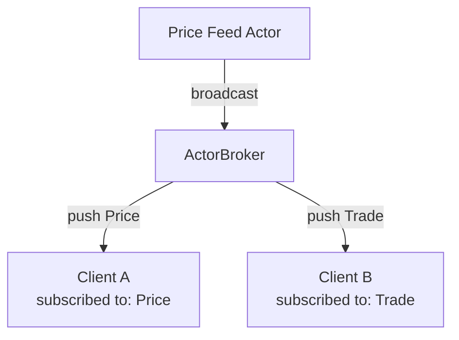

This page covers the three main IPC communication patterns: request-response, streaming, and push notifications via subscriptions.

---

## Pattern 1: Request-Response

Client sends a request, actor sends a single response. This is the most common pattern for RPC-style calls.

### Server Side

```rust
use acton_reactive::prelude::*;

#[acton_message(ipc)]
struct AddRequest { a: i32, b: i32 }

#[acton_message(ipc)]
struct AddResult { sum: i32 }

// Register types
registry.register::<AddRequest>("AddRequest");
registry.register::<AddResult>("AddResult");

// Handler
calculator.mutate_on::<AddRequest>(|_actor, ctx| {
    let a = ctx.message().a;
    let b = ctx.message().b;
    let reply = ctx.reply_envelope();

    Reply::pending(async move {
        reply.send(AddResult { sum: a + b }).await;
    })
});
```

### Client Side

```text
SEND: IpcEnvelope {
    target: "calculator",
    message_type: "AddRequest",
    payload: { a: 5, b: 3 },
    expects_reply: true
}

RECEIVE: IpcResponse {
    success: true,
    payload: { sum: 8 }
}
```

### Python Client

```python
client = ActonClient()
client.send("calculator", "AddRequest", {"a": 5, "b": 3})
response = client.receive()
print(f"Result: {response['payload']['sum']}")  # 8
```

---

## Pattern 2: Request-Stream

Client sends a request, actor sends multiple response frames. Use this for pagination, countdown timers, or real-time data feeds.

### Server Side

```rust
use acton_reactive::prelude::*;

#[acton_message(ipc)]
struct ListRequest { page_size: usize }

#[acton_message(ipc)]
struct ListItem { id: u64, name: String }

// Handler sends multiple responses
actor.mutate_on::<ListRequest>(|actor, ctx| {
    let page_size = ctx.message().page_size;
    let items = actor.model.items.clone();
    let reply = ctx.reply_envelope();

    Reply::pending(async move {
        for chunk in items.chunks(page_size) {
            for item in chunk {
                reply.send(ListItem {
                    id: item.id,
                    name: item.name.clone(),
                }).await;
            }
        }
    })
});
```

### Client Side

```text
SEND: IpcEnvelope {
    target: "list_service",
    message_type: "ListRequest",
    payload: { page_size: 10 },
    expects_stream: true
}

RECEIVE: IpcStreamFrame { sequence: 0, payload: {...}, is_final: false }
RECEIVE: IpcStreamFrame { sequence: 1, payload: {...}, is_final: false }
RECEIVE: IpcStreamFrame { sequence: 2, payload: {...}, is_final: true }
```

### Countdown Example

```rust
#[acton_message(ipc)]
struct CountdownRequest { from: u32, delay_ms: u64 }

#[acton_message(ipc)]
struct CountdownTick { value: u32 }

actor.mutate_on::<CountdownRequest>(|_actor, ctx| {
    let start = ctx.message().from;
    let delay = ctx.message().delay_ms;
    let reply = ctx.reply_envelope();

    Reply::pending(async move {
        for i in (1..=start).rev() {
            reply.send(CountdownTick { value: i }).await;
            tokio::time::sleep(Duration::from_millis(delay)).await;
        }
    })
});
```

---

## Pattern 3: Push Notifications (Subscriptions)

Client subscribes to message types and receives pushed notifications whenever those messages are broadcast.

### Server Side

```rust
use acton_reactive::prelude::*;

#[acton_message(ipc)]
struct PriceUpdate { symbol: String, price: f64 }

// Register subscribable type
registry.register::<PriceUpdate>("PriceUpdate");

// Background task broadcasts updates
let broker = runtime.broker();
tokio::spawn(async move {
    loop {
        tokio::time::sleep(Duration::from_secs(1)).await;
        broker.broadcast(PriceUpdate {
            symbol: "ACME".to_string(),
            price: get_current_price(),
        }).await;
    }
});
```

### Client Side

```text
SEND: SubscribeRequest {
    message_types: ["PriceUpdate", "TradeExecuted"]
}

// Continuous stream of push notifications
RECEIVE: IpcPushNotification { message_type: "PriceUpdate", payload: {...} }
RECEIVE: IpcPushNotification { message_type: "PriceUpdate", payload: {...} }
...
```

### Architecture



---

## Multiple Services

Expose multiple actors with different responsibilities:

```rust
// Register all types
registry.register::<AddRequest>("AddRequest");
registry.register::<AddResult>("AddResult");
registry.register::<SetValue>("SetValue");
registry.register::<GetValue>("GetValue");
registry.register::<ValueResponse>("ValueResponse");

// Expose multiple services
runtime.ipc_expose("calculator", calculator_handle);
runtime.ipc_expose("kv_store", kv_store_handle);
runtime.ipc_expose("price_feed", price_feed_handle);
```

Clients target different services:

```python
# Calculator service
client.send("calculator", "AddRequest", {"a": 5, "b": 3})

# Key-value store
client.send("kv_store", "SetValue", {"key": "name", "value": "Alice"})
client.send("kv_store", "GetValue", {"key": "name"})
```

---

## Stateful Services

Actors maintain state across requests:

```rust
#[acton_actor]
struct KvStore {
    data: HashMap<String, String>,
}

#[acton_message(ipc)]
struct SetValue { key: String, value: String }

#[acton_message(ipc)]
struct GetValue { key: String }

#[acton_message(ipc)]
struct ValueResponse { value: Option<String> }

// Set handler
kv_store.mutate_on::<SetValue>(|actor, ctx| {
    let key = ctx.message().key.clone();
    let value = ctx.message().value.clone();
    actor.model.data.insert(key, value);
    Reply::ready()
});

// Get handler
kv_store.act_on::<GetValue>(|actor, ctx| {
    let key = &ctx.message().key;
    let value = actor.model.data.get(key).cloned();
    let reply = ctx.reply_envelope();

    Reply::pending(async move {
        reply.send(ValueResponse { value }).await;
    })
});
```

---

## Error Handling in Patterns

### Client-Side Error Handling

```python
response = client.receive()

if not response['success']:
    error = response['error']
    if 'UnknownMessageType' in error:
        print("Server doesn't recognize message type")
    elif 'ActorNotFound' in error:
        print("Target service not available")
    elif 'RateLimited' in error:
        print("Too many requests, backing off...")
        time.sleep(1)
        # Retry...
```

### Server-Side with Fallible Handlers

```rust
#[derive(Debug, Error)]
enum OrderError {
    #[error("Product not found: {0}")]
    ProductNotFound(String),
    #[error("Out of stock")]
    OutOfStock,
}

actor.try_mutate_on::<PlaceOrder>(|actor, ctx| {
    let product = &ctx.message().product;

    if !actor.model.products.contains(product) {
        return Reply::try_err(OrderError::ProductNotFound(product.clone()));
    }

    if actor.model.stock.get(product).unwrap_or(&0) == &0 {
        return Reply::try_err(OrderError::OutOfStock);
    }

    // Process order...
    Reply::try_ok(OrderConfirmed { order_id: "..." })
});
```

---

## Monitoring IPC

Track listener statistics:

```rust
let listener = runtime.start_ipc_listener().await?;

// Periodic monitoring
tokio::spawn(async move {
    loop {
        let stats = listener.stats();
        println!(
            "Connections: {}, Messages: {}, Errors: {}",
            stats.active_connections,
            stats.messages_processed,
            stats.errors
        );
        tokio::time::sleep(Duration::from_secs(60)).await;
    }
});
```

---

## Pattern Comparison

| Pattern | When to Use | Response Count |
|---------|-------------|----------------|
| Request-Response | RPC calls, queries | 1 |
| Request-Stream | Pagination, countdowns, feeds | N |
| Subscriptions | Events, real-time updates | Continuous |

---

## Next Steps

- [IPC Setup](/docs/ipc-setup) - Enable and configure IPC
- [IPC Protocol](/docs/ipc-protocol) - Wire format details
- [Examples](/docs/examples) - Complete IPC examples
