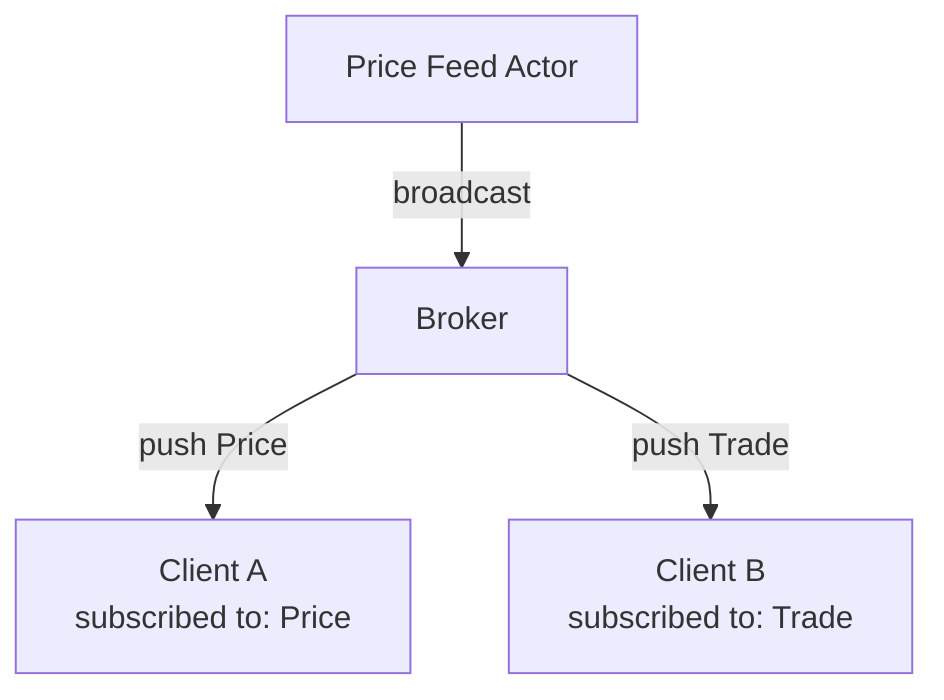

This page covers the three main IPC communication patterns: request-response, streaming, and push notifications via subscriptions.

---

## Pattern 1: Request-Response

Client sends a request, actor sends a single response. This is the most common pattern for RPC-style calls.

### Server Side

```rust
use acton_reactive::prelude::*;

#[acton_message(ipc)]
struct AddRequest { a: i32, b: i32 }

#[acton_message(ipc)]
struct AddResult { sum: i32 }

// Register types
registry.register::<AddRequest>("AddRequest");
registry.register::<AddResult>("AddResult");

// Handler
calculator.mutate_on::<AddRequest>(|_actor, ctx| {
    let a = ctx.message().a;
    let b = ctx.message().b;
    let reply = ctx.reply_envelope();

    Reply::pending(async move {
        reply.send(AddResult { sum: a + b }).await;
    })
});
```

### Rust Client

Use [`IpcClient`](#the-rust-client-ipcclient) — it handles framing, correlation, and timeouts for you:

```rust
use acton_reactive::prelude::*;

let client = IpcClient::connect(socket_path).await?;

let envelope = IpcEnvelope::new_request(
    "calculator",
    "AddRequest",
    serde_json::json!({ "a": 5, "b": 3 }),
);

let response = client.request(envelope).await?;
println!("Result: {:?}", response.payload);  // { "sum": 8 }
```

### On the Wire

`correlation_id` is **mandatory** — it is how the response is matched to the request. `IpcEnvelope::new_request` generates one for you; hand-written clients must supply it.

```text
SEND: IpcEnvelope {
    correlation_id: "req_01h9xz7n2e5p6q8r3t1u2v3w4x",
    target: "calculator",
    message_type: "AddRequest",
    payload: { a: 5, b: 3 },
    expects_reply: true
}

RECEIVE: IpcResponse {
    correlation_id: "req_01h9xz7n2e5p6q8r3t1u2v3w4x",
    success: true,
    payload: { sum: 8 }
}
```


If `expects_reply` is `false` (the default, and what `IpcEnvelope::new` produces), the server treats the message as fire-and-forget and replies with `{"status": "delivered"}` — the actor's reply is **not** forwarded. Use `IpcEnvelope::new_request` whenever you want the actor's response.


### Python Client

```python
from acton_ipc import ActonIpcClient

client = ActonIpcClient(socket_path)
await client.connect()

response = await client.request("calculator", "AddRequest", {"a": 5, "b": 3})
print(f"Result: {response.payload['sum']}")  # 8
```

---

## Pattern 2: Request-Stream

Client sends a request, actor sends multiple response frames. Use this for pagination, countdown timers, or real-time data feeds.

### Server Side

```rust
use acton_reactive::prelude::*;

#[acton_message(ipc)]
struct ListRequest { page_size: usize }

#[acton_message(ipc)]
struct ListItem { id: u64, name: String }

// Handler sends multiple responses
actor.mutate_on::<ListRequest>(|actor, ctx| {
    let page_size = ctx.message().page_size;
    let items = actor.model.items.clone();
    let reply = ctx.reply_envelope();

    Reply::pending(async move {
        for chunk in items.chunks(page_size) {
            for item in chunk {
                reply.send(ListItem {
                    id: item.id,
                    name: item.name.clone(),
                }).await;
            }
        }
    })
});
```

### Client Side

Build the request with `IpcEnvelope::new_stream_request` (or `new_stream_request_with_timeout`), which sets `expects_stream: true` and generates a `str_`-prefixed correlation ID:

```text
SEND: IpcEnvelope {
    correlation_id: "str_01h9xz7n2e5p6q8r3t1u2v3w4x",
    target: "list_service",
    message_type: "ListRequest",
    payload: { page_size: 10 },
    expects_stream: true
}

RECEIVE: IpcStreamFrame { correlation_id: "str_01h9...", sequence: 0, payload: {...}, is_final: false }
RECEIVE: IpcStreamFrame { correlation_id: "str_01h9...", sequence: 1, payload: {...}, is_final: false }
RECEIVE: IpcStreamFrame { correlation_id: "str_01h9...", sequence: 2, payload: {...}, is_final: true }
```

Stream frames arrive as message type `0x09`. Keep reading frames until one has `is_final: true`.


`IpcClient` does not decode stream frames — it covers request-response, fire-and-forget, subscriptions, and discovery. For request-stream, read frames directly with `protocol::read_frame` and `protocol::is_stream`, as the `ipc_streaming` example does.


```rust
use acton_reactive::ipc::protocol::{is_stream, read_frame, write_envelope, MAX_FRAME_SIZE};
use acton_reactive::ipc::{IpcEnvelope, IpcStreamFrame};

let envelope = IpcEnvelope::new_stream_request(
    "list_service",
    "ListRequest",
    serde_json::json!({ "page_size": 10 }),
);
write_envelope(&mut writer, &envelope).await?;

loop {
    let (msg_type, _format, payload) = read_frame(&mut reader, MAX_FRAME_SIZE).await?;
    if !is_stream(msg_type) {
        break;
    }

    let frame: IpcStreamFrame = serde_json::from_slice(&payload)?;
    println!("frame {}: {:?}", frame.sequence, frame.payload);

    if frame.is_final {
        break;
    }
}
```

### Countdown Example

```rust
#[acton_message(ipc)]
struct CountdownRequest { from: u32, delay_ms: u64 }

#[acton_message(ipc)]
struct CountdownTick { value: u32 }

actor.mutate_on::<CountdownRequest>(|_actor, ctx| {
    let start = ctx.message().from;
    let delay = ctx.message().delay_ms;
    let reply = ctx.reply_envelope();

    Reply::pending(async move {
        for i in (1..=start).rev() {
            reply.send(CountdownTick { value: i }).await;
            tokio::time::sleep(Duration::from_millis(delay)).await;
        }
    })
});
```

---

## Pattern 3: Push Notifications (Subscriptions)

Client subscribes to message types and receives pushed notifications whenever those messages are broadcast.

### Server Side

```rust
use acton_reactive::prelude::*;

#[acton_message(ipc)]
struct PriceUpdate { symbol: String, price: f64 }

// Register subscribable type
registry.register::<PriceUpdate>("PriceUpdate");

// Background task broadcasts updates
let broker = runtime.broker();
tokio::spawn(async move {
    loop {
        tokio::time::sleep(Duration::from_secs(1)).await;
        broker.broadcast(PriceUpdate {
            symbol: "ACME".to_string(),
            price: get_current_price(),
        }).await;
    }
});
```

### Client Side

Subscribing is **not** an `IpcEnvelope`. `IpcSubscribeRequest` is its own frame type (`0x06`), and like every request it carries a mandatory `correlation_id`:

```rust
let client = IpcClient::connect(socket_path).await?;

let response = client
    .subscribe(vec!["PriceUpdate".to_string(), "TradeExecuted".to_string()])
    .await?;
println!("Subscribed to: {:?}", response.subscribed_types);

let mut push_rx = client.take_push_receiver().expect("receiver not yet taken");

while let Some(notification) = push_rx.recv().await {
    println!("{}: {:?}", notification.message_type, notification.payload);
}
```

On the wire:

```text
SEND (frame type 0x06): IpcSubscribeRequest {
    correlation_id: "sub_01h9xz7n2e5p6q8r3t1u2v3w4x",
    message_types: ["PriceUpdate", "TradeExecuted"]
}

RECEIVE: IpcSubscriptionResponse {
    correlation_id: "sub_01h9xz7n2e5p6q8r3t1u2v3w4x",
    success: true,
    subscribed_types: ["PriceUpdate", "TradeExecuted"]
}

// Continuous push notifications (frame type 0x05)
RECEIVE: IpcPushNotification {
    notification_id: "push_01h9...",
    message_type: "PriceUpdate",
    source_actor: "price_feed",
    payload: {...},
    timestamp_ms: 1723209600000
}
...
```

To stop, send `IpcUnsubscribeRequest` (frame type `0x07`) — or `client.unsubscribe(vec![])`, where an empty list unsubscribes from everything. Subscriptions are also cleaned up automatically when the connection drops.


Push forwarding serializes broadcasts through the IPC type registry, so a broadcast type only reaches subscribers if it was registered with `registry.register::<T>("T")`. Subscribers never time out by default (`timeouts.subscription_read` is `0`), and if a client reads too slowly, notifications beyond `limits.push_buffer_size` (default 100) are dropped.


### Architecture


```mermaid
flowchart TD
    PF["Price Feed Actor"] -->|broadcast| Broker["Broker"]
    Broker -->|push Price| CA["Client A<br/>subscribed to: Price"]
    Broker -->|push Trade| CB["Client B<br/>subscribed to: Trade"]
```

---

## Multiple Services

Expose multiple actors with different responsibilities:

```rust
// Register all types
registry.register::<AddRequest>("AddRequest");
registry.register::<AddResult>("AddResult");
registry.register::<SetValue>("SetValue");
registry.register::<GetValue>("GetValue");
registry.register::<ValueResponse>("ValueResponse");

// Create and expose multiple services using expose_for_ipc
let mut calculator = runtime.new_actor_with_name::<Calculator>("calculator".to_string());
calculator.expose_for_ipc();
calculator.start().await;

let mut kv_store = runtime.new_actor_with_name::<KvStore>("kv_store".to_string());
kv_store.expose_for_ipc();
kv_store.start().await;

let mut price_feed = runtime.new_actor_with_name::<PriceFeed>("price_feed".to_string());
price_feed.expose_for_ipc();
price_feed.start().await;
```

Clients target different services by name:

```python
# Calculator service
await client.request("calculator", "AddRequest", {"a": 5, "b": 3})

# Key-value store
await client.request("kv_store", "SetValue", {"key": "name", "value": "Alice"})
await client.request("kv_store", "GetValue", {"key": "name"})
```

---

## Stateful Services

Actors maintain state across requests:

```rust
#[acton_actor]
struct KvStore {
    data: HashMap<String, String>,
}

#[acton_message(ipc)]
struct SetValue { key: String, value: String }

#[acton_message(ipc)]
struct GetValue { key: String }

#[acton_message(ipc)]
struct ValueResponse { value: Option<String> }

// Set handler
kv_store.mutate_on::<SetValue>(|actor, ctx| {
    let key = ctx.message().key.clone();
    let value = ctx.message().value.clone();
    actor.model.data.insert(key, value);
    Reply::ready()
});

// Get handler
kv_store.act_on::<GetValue>(|actor, ctx| {
    let key = &ctx.message().key;
    let value = actor.model.data.get(key).cloned();
    let reply = ctx.reply_envelope();

    Reply::pending(async move {
        reply.send(ValueResponse { value }).await;
    })
});
```

---

## Error Handling in Patterns

### Client-Side Error Handling

Error responses carry a machine-readable `error_code` alongside the human-readable `error` message. Branch on the code, not on the message text:

```python
response = await client.request("calculator", "AddRequest", {"a": 5, "b": 3})

if not response.success:
    if response.error_code == 'UNKNOWN_MESSAGE_TYPE':
        print("Server doesn't recognize this message type")
    elif response.error_code == 'ACTOR_NOT_FOUND':
        print("Target service not available")
    elif response.error_code == 'RATE_LIMITED':
        print("Too many requests, backing off...")
        await asyncio.sleep(1)
        # Retry...
```

The full set of `error_code` values:

| Code | Meaning |
|------|---------|
| `UNKNOWN_MESSAGE_TYPE` | Type not registered on the server |
| `ACTOR_NOT_FOUND` | No actor exposed under that name |
| `SERIALIZATION_ERROR` | Payload could not be (de)serialized |
| `TARGET_BUSY` | Actor's inbox is full — back off and retry |
| `TIMEOUT` | Actor did not reply within `response_timeout_ms` |
| `RATE_LIMITED` | Connection exceeded its rate limit |
| `SHUTTING_DOWN` | Server is draining and rejecting new requests |
| `PROTOCOL_ERROR` | Malformed frame |
| `UNSUPPORTED_PROTOCOL_VERSION` | Version byte outside the supported range |
| `IO_ERROR` / `CONNECTION_CLOSED` | Transport failure |

### Server-Side Errors


`try_mutate_on` / `try_act_on` results are **local only**. The `Ok` value returned by `Reply::try_ok(..)` is discarded, and a `Reply::try_err(..)` is routed to the actor's own `on_error` handler — neither is turned into an `IpcResponse`. The only thing forwarded to an IPC client is a message you explicitly send through `ctx.reply_envelope()`.


To report a failure over IPC, model it as an explicit message type and send it through the reply envelope:

```rust
#[acton_message(ipc)]
struct OrderConfirmed { order_id: String }

#[acton_message(ipc)]
struct OrderRejected { reason: String }

// Register both, exactly like any other IPC type.
registry.register::<OrderConfirmed>("OrderConfirmed");
registry.register::<OrderRejected>("OrderRejected");

actor.mutate_on::<PlaceOrder>(|actor, ctx| {
    let product = ctx.message().product.clone();
    let reply = ctx.reply_envelope();

    let in_stock = actor.model.products.contains(&product)
        && actor.model.stock.get(&product).copied().unwrap_or(0) > 0;

    if in_stock {
        actor.model.place_order(&product);
    }

    Reply::pending(async move {
        if in_stock {
            reply.send(OrderConfirmed { order_id: "ord_123".to_string() }).await;
        } else {
            reply.send(OrderRejected { reason: format!("Out of stock: {product}") }).await;
        }
    })
});
```

The client receives whichever message the actor sent, as a successful `IpcResponse` whose payload is that message. Reserve `try_mutate_on` + `on_error` for failures the *actor* handles internally (retries, supervision, logging), not for failures the caller needs to see.

---

## Monitoring IPC

`stats` is a field on the listener handle (an `Arc<IpcListenerStats>`), and each counter is read through an accessor method:

```rust
let listener = runtime.start_ipc_listener().await?;

// Periodic monitoring
let stats = listener.stats.clone();
tokio::spawn(async move {
    loop {
        println!(
            "Connections: {}, Routed: {}, Errors: {}, Rate limited: {}",
            stats.connections_active(),
            stats.messages_routed(),
            stats.errors(),
            stats.rate_limited(),
        );
        tokio::time::sleep(Duration::from_secs(60)).await;
    }
});
```

Available counters:

| Accessor | Description |
|----------|-------------|
| `connections_accepted()` | Total connections accepted since start |
| `connections_active()` | Currently open connections |
| `messages_received()` | Frames received |
| `messages_routed()` | Messages successfully delivered to an actor |
| `errors()` | Errors encountered |
| `rate_limited()` | Requests rejected by the rate limiter |
| `backpressure_rejections()` | Requests rejected because an actor's inbox was full |
| `shutdown_rejections()` | Requests rejected while draining |
| `in_flight_requests()` | Requests currently being processed |
| `subscriptions_processed()` | Subscribe/unsubscribe requests handled |
| `push_notifications_sent()` | Push notifications delivered to clients |

---

## The Rust Client: IpcClient

`IpcClient` is the supported way to talk to an acton-reactive server from Rust. It owns the socket, runs dedicated reader and writer tasks, and matches responses to requests by correlation ID — so you never hand-roll framing.

It is exported from the prelude, and covers request-response, fire-and-forget, subscriptions, and discovery. (Request-stream needs the raw protocol — see [Pattern 2](#pattern-2-request-stream).)

### Connecting

```rust
use acton_reactive::prelude::*;
use acton_reactive::ipc::{socket_exists, socket_is_alive};

// Resolve the same socket path the server uses.
let socket_path = IpcConfig::load().socket_path();

if !socket_exists(&socket_path) || !socket_is_alive(&socket_path).await {
    eprintln!("Server is not running at {}", socket_path.display());
    return Ok(());
}

let client = IpcClient::connect(&socket_path).await?;
```

For custom settings, use `IpcClient::connect_with_config`:

```rust
use acton_reactive::ipc::protocol::Format;

let config = IpcClientConfig {
    format: Format::Json,          // or Format::MessagePack with `ipc-messagepack`
    default_timeout: Duration::from_secs(10),
    ..Default::default()
};

let client = IpcClient::connect_with_config(&socket_path, config).await?;
```

`IpcClientConfig` defaults: `writer_channel_capacity` 64, `push_channel_capacity` 256, `default_timeout` 30s, `max_frame_size` 16 MiB.

### Request-Response

```rust
let envelope = IpcEnvelope::new_request(
    "calculator",
    "AddRequest",
    serde_json::json!({ "a": 5, "b": 3 }),
);

let response = client.request(envelope).await?;

if response.success {
    println!("Sum: {:?}", response.payload);
} else {
    eprintln!("{:?}: {:?}", response.error_code, response.error);
}
```

Override the client's default timeout per call with `request_with_timeout`:

```rust
let response = client
    .request_with_timeout(envelope, Duration::from_secs(5))
    .await?;
```

### Fire-and-Forget

`send` enqueues the message and returns as soon as it is buffered. Build it with `IpcEnvelope::new` (which sets `expects_reply: false`); the server acknowledges with `{"status": "delivered"}` and the client drains that ack for you.

```rust
let envelope = IpcEnvelope::new(
    "metrics",
    "RecordHit",
    serde_json::json!({ "route": "/home" }),
);

client.send(envelope).await?;
```

### Subscriptions

```rust
let response = client.subscribe(vec!["PriceUpdate".to_string()]).await?;
println!("Subscribed to: {:?}", response.subscribed_types);

// Take the receiver once; a second call returns None.
let mut push_rx = client.take_push_receiver().expect("receiver not yet taken");

while let Some(notification) = push_rx.recv().await {
    println!("{}: {:?}", notification.message_type, notification.payload);
}

// Empty vec = unsubscribe from everything.
client.unsubscribe(vec![]).await?;
```

### Discovery

Ask a running server what it exposes:

```rust
let discovery = client.discover().await?;

if let Some(actors) = discovery.actors {
    for actor in actors {
        println!("actor: {} ({})", actor.name, actor.ern);
    }
}
if let Some(types) = discovery.message_types {
    println!("registered types: {types:?}");
}
```

### Disconnecting

`disconnect` drains pending writes before closing. Dropping the client aborts its tasks instead, so prefer an explicit disconnect for a clean shutdown.

```rust
if client.is_connected() {
    client.disconnect().await?;
}
```

---

## Pattern Comparison

| Pattern | When to Use | Response Count | `IpcClient` support |
|---------|-------------|----------------|---------------------|
| Request-Response | RPC calls, queries | 1 | `request()` |
| Request-Stream | Pagination, countdowns, feeds | N | raw protocol |
| Subscriptions | Events, real-time updates | Continuous | `subscribe()` + `take_push_receiver()` |

---

## Next Steps

- [IPC Setup](/docs/ipc-setup) - Enable and configure IPC, plus the wire protocol
- [Configuration](/docs/configuration) - Full `ipc.toml` reference
- [Examples](/docs/examples) - Complete IPC examples
