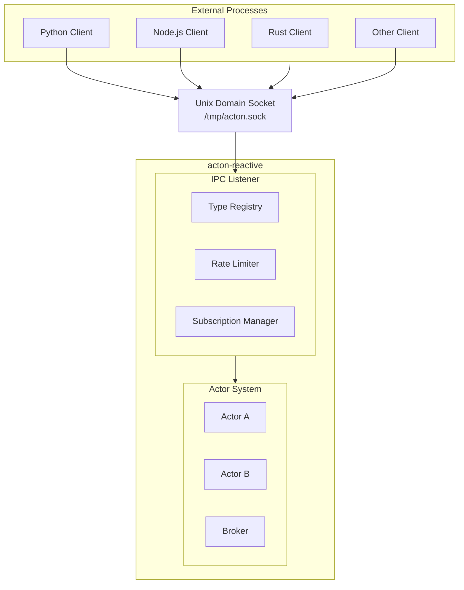

Enable external processes to communicate with your actors via Unix Domain Sockets.

---

## Overview

The IPC module allows external processes (written in any language) to communicate with `acton-reactive` actors.

### Capabilities

| Pattern | Description | Use Case |
|---------|-------------|----------|
| **Request-Response** | Single reply to single request | RPC-style calls |
| **Request-Stream** | Multiple frames per request | Pagination, real-time data |
| **Push Notifications** | Server-initiated messages | Subscriptions, events |

### Architecture



---

## Enabling IPC

### Cargo Feature

Add the `ipc` feature to your `Cargo.toml`:

```toml
[dependencies]
acton-reactive = { version = "0.1", features = ["ipc"] }
```

For MessagePack serialization (smaller messages):

```toml
[dependencies]
acton-reactive = { version = "0.1", features = ["ipc-messagepack"] }
```

### Feature Comparison

| Feature | Serialization | Message Size | Speed |
|---------|---------------|--------------|-------|
| `ipc` | JSON | Larger | Good |
| `ipc-messagepack` | MessagePack | ~30-50% smaller | Better |

---

## Basic Setup

```rust
use acton_reactive::prelude::*;

#[acton_main]
async fn main() -> anyhow::Result<()> {
    // 1. Launch runtime
    let mut runtime = ActonApp::launch();

    // 2. Get IPC type registry
    let registry = runtime.ipc_registry();

    // 3. Register message types
    registry.register::<MyRequest>("MyRequest");
    registry.register::<MyResponse>("MyResponse");

    // 4. Create and start actors
    let actor = runtime.new_actor::<MyState>().start().await;

    // 5. Expose actors via IPC
    runtime.ipc_expose("my_service", actor);

    // 6. Start IPC listener
    let listener = runtime.start_ipc_listener().await?;

    // Wait for shutdown signal
    tokio::signal::ctrl_c().await?;

    // 7. Clean shutdown
    listener.shutdown().await?;
    runtime.shutdown_all().await?;

    Ok(())
}
```

---

## Configuration

### Custom Configuration

```rust
use acton_reactive::common::ipc::{IpcConfig, RateLimitConfig};
use std::path::PathBuf;
use std::time::Duration;

let config = IpcConfig {
    socket_path: PathBuf::from("/var/run/myapp/acton.sock"),
    max_connections: 100,
    connection_timeout: Duration::from_secs(60),
    rate_limit: Some(RateLimitConfig {
        requests_per_second: 1000,
        burst_size: 50,
    }),
};

let listener = runtime.start_ipc_listener_with_config(config).await?;
```

### Configuration Options

| Option | Type | Default | Description |
|--------|------|---------|-------------|
| `socket_path` | `PathBuf` | `/tmp/acton.sock` | Unix socket path |
| `max_connections` | `usize` | `100` | Max concurrent connections |
| `connection_timeout` | `Duration` | `30s` | Idle connection timeout |
| `rate_limit` | `Option<RateLimitConfig>` | `None` | Request rate limiting |

---

## Message Type Registration

All message types sent over IPC must be registered.

### Using the IPC Macro

```rust
use acton_reactive::prelude::*;

// Use #[acton_message(ipc)] for IPC-compatible message types
// This derives Clone, Debug, Serialize, and Deserialize
#[acton_message(ipc)]
struct MyRequest {
    query: String,
}

#[acton_message(ipc)]
struct MyResponse {
    result: String,
}

// Register with string identifier
let registry = runtime.ipc_registry();
registry.register::<MyRequest>("MyRequest");
registry.register::<MyResponse>("MyResponse");
```

### Type Name Guidelines

- Use the struct name as the type identifier
- Keep names consistent between client and server
- Consider namespacing: `"calculator.AddRequest"`

### Checking Registration

```rust
if registry.is_registered("MyRequest") {
    println!("Type is registered");
}

// List all registered types
let types = registry.registered_types();
println!("Registered types: {:?}", types);
```

---

## Exposing Actors

### Basic Exposure

```rust
// Expose a single actor
runtime.ipc_expose("calculator", calculator_handle);

// Expose multiple actors
runtime.ipc_expose("kv_store", kv_store_handle);
runtime.ipc_expose("price_feed", price_feed_handle);
```

### Hiding Actors

```rust
// Remove actor from IPC (but keep it running)
runtime.ipc_hide("calculator");
```

### Dynamic Exposure

```rust
// Expose actors based on configuration
if config.enable_calculator {
    runtime.ipc_expose("calculator", calc_handle);
}
```

---

## Best Practices

### 1. Register Types at Startup

```rust
// Register all types before starting the listener
registry.register::<Request1>("Request1");
registry.register::<Response1>("Response1");
registry.register::<Request2>("Request2");
registry.register::<Response2>("Response2");

// Then start listener
let listener = runtime.start_ipc_listener().await?;
```

### 2. Socket Cleanup

```rust
// Check for stale sockets before starting
let socket_path = Path::new("/tmp/acton.sock");
if socket_path.exists() {
    std::fs::remove_file(socket_path)?;
}

// Start listener
let listener = runtime.start_ipc_listener().await?;

// On shutdown
listener.shutdown().await?;
```

### 3. Connection Timeouts

```rust
// Short timeout for request-response
let config = IpcConfig {
    connection_timeout: Duration::from_secs(30),
    ..Default::default()
};

// Longer for subscriptions
let config = IpcConfig {
    connection_timeout: Duration::from_secs(3600), // 1 hour
    ..Default::default()
};
```

### 4. Rate Limiting

```rust
let config = IpcConfig {
    rate_limit: Some(RateLimitConfig {
        requests_per_second: 100,
        burst_size: 20,
    }),
    ..Default::default()
};
```

### 5. Health Checks

```rust
#[acton_message(ipc)]
struct HealthCheck;

#[acton_message(ipc)]
struct HealthStatus { status: String }

registry.register::<HealthCheck>("HealthCheck");
registry.register::<HealthStatus>("HealthStatus");

actor.act_on::<HealthCheck>(|_, ctx| {
    let reply = ctx.reply_envelope();
    Reply::pending(async move {
        reply.send(HealthStatus { status: "ok".to_string() }).await;
    })
});
```

---

## Next Steps

- [IPC Protocol](/docs/ipc-protocol) - Wire format and message structures
- [IPC Patterns](/docs/ipc-patterns) - Request-response, streaming, subscriptions
- [Examples](/docs/examples) - Working IPC examples
