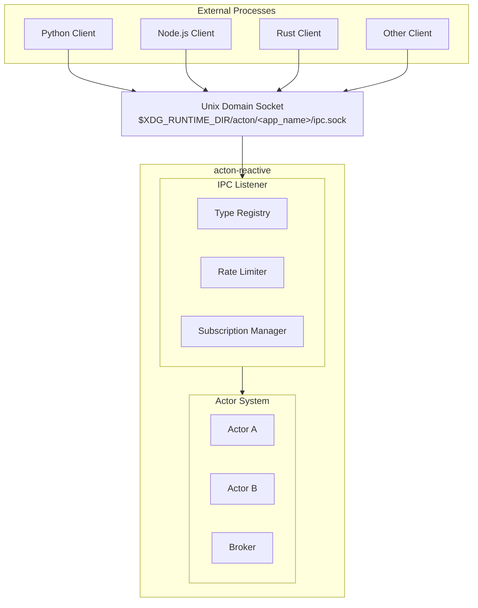

Enable external processes to communicate with your actors via Unix Domain Sockets.

---

## Overview

The IPC module allows external processes (written in any language) to communicate with `acton-reactive` actors.

### Capabilities

| Pattern | Description | Use Case |
|---------|-------------|----------|
| **Request-Response** | Single reply to single request | RPC-style calls |
| **Request-Stream** | Multiple frames per request | Pagination, real-time data |
| **Push Notifications** | Server-initiated messages | Subscriptions, events |

### Architecture


```mermaid
flowchart TD
    subgraph External["External Processes"]
        Py["Python Client"]
        Node["Node.js Client"]
        Rs["Rust Client"]
        Other["Other Client"]
    end

    Py & Node & Rs & Other --> Socket["Unix Domain Socket<br/>$XDG_RUNTIME_DIR/acton/&lt;app_name&gt;/ipc.sock"]

    subgraph Acton["acton-reactive"]
        subgraph Listener["IPC Listener"]
            TR["Type Registry"]
            RL["Rate Limiter"]
            SM["Subscription Manager"]
        end

        subgraph Actors["Actor System"]
            AA["Actor A"]
            AB["Actor B"]
            Broker["Broker"]
        end

        Listener --> Actors
    end

    Socket --> Listener
```

---

## Enabling IPC

### Cargo Feature

Add the `ipc` feature to your `Cargo.toml`:

```toml
[dependencies]

```

For MessagePack serialization (smaller messages):

```toml
[dependencies]

```

### Feature Comparison

| Feature | Serialization | Format byte | Message Size | Speed |
|---------|---------------|-------------|--------------|-------|
| `ipc` | JSON | `0x01` | Larger | Good |
| `ipc-messagepack` | MessagePack | `0x02` | ~30-50% smaller | Better |

`ipc-messagepack` is additive: it enables `ipc` and lets the server accept **both** formats. Each frame declares its own format byte, so JSON and MessagePack clients can talk to the same listener at the same time.


As of 8.1, MessagePack payloads are encoded as **maps with named keys**, not positional arrays. Non-Rust clients must serialize structs as maps (`{"symbol": "ACME", "price": 1.0}`), not as arrays (`["ACME", 1.0]`). Array-style encoding will fail to deserialize.


---

## Basic Setup

```rust
use acton_reactive::prelude::*;

#[acton_main]
async fn main() -> anyhow::Result<()> {
    // 1. Launch runtime
    let mut runtime = ActonApp::launch_async().await;

    // 2. Get IPC type registry
    let registry = runtime.ipc_registry();

    // 3. Register message types
    registry.register::<MyRequest>("MyRequest");
    registry.register::<MyResponse>("MyResponse");

    // 4. Create, configure, and expose actors
    let mut actor = runtime.new_actor_with_name::<MyState>("my_service".to_string());
    actor
        .act_on::<MyRequest>(|actor, ctx| { /* ... */ })
        .expose_for_ipc();  // Expose using the actor's name
    actor.start().await;

    // 5. Start IPC listener
    let listener = runtime.start_ipc_listener().await?;

    // Wait for shutdown signal
    tokio::signal::ctrl_c().await?;

    // 6. Clean shutdown
    listener.shutdown_gracefully().await;
    runtime.shutdown_all().await?;

    Ok(())
}
```

---

## Configuration

`start_ipc_listener()` loads configuration from `$XDG_CONFIG_HOME/acton/ipc.toml` (typically `~/.config/acton/ipc.toml`). If no file exists, defaults are used. See [Configuration](/docs/configuration) for the full reference.

### ipc.toml

```toml
[socket]
# Override the default socket path (optional).
# Default: $XDG_RUNTIME_DIR/acton/<app_name>/ipc.sock
# path = "/run/user/1000/acton/my_app/ipc.sock"
mode = 0o660             # Socket file permissions (Unix)
# app_name = "my_app"    # Defaults to the binary name

[limits]
max_connections = 1024
max_message_size = 1048576   # 1 MiB
push_buffer_size = 100       # Buffered push notifications per connection

[rate_limit]
enabled = true               # Rate limiting is ON by default
requests_per_second = 100    # Token bucket refill rate, per connection
burst_size = 50              # Token bucket capacity

[timeouts]
request_timeout_ms = 30000
read_timeout_ms = 60000              # 0 = no timeout
write_timeout_ms = 30000
subscription_read_timeout_ms = 0     # 0 = no timeout (default for subscribers)

[shutdown]
drain_timeout_ms = 5000      # Max wait for in-flight requests on shutdown
```

### Configuring Programmatically

`IpcConfig` is a nested struct. Start from `IpcConfig::load()` (which reads `ipc.toml` or falls back to defaults), adjust the fields you care about, and pass it to `start_ipc_listener_with_config`:

```rust
use acton_reactive::prelude::*;
use std::path::PathBuf;

let mut config = IpcConfig::load();

config.socket.path = Some(PathBuf::from("/run/user/1000/myapp/acton.sock"));
config.limits.max_connections = 50;
config.rate_limit.requests_per_second = 1000;
config.rate_limit.burst_size = 200;
config.timeouts.read = 0;  // no idle timeout

let listener = runtime.start_ipc_listener_with_config(config).await?;
```


`RateLimitConfig` and `ShutdownConfig` are reached through `config.rate_limit` and `config.shutdown` on a loaded `IpcConfig`. Set their fields directly (or in `ipc.toml`) — there is nothing extra to import beyond `IpcConfig`, which the prelude already provides.


### Configuration Options

| Option | Type | Default | Description |
|--------|------|---------|-------------|
| `socket.path` | `Option<PathBuf>` | `$XDG_RUNTIME_DIR/acton/<app_name>/ipc.sock` (falls back to `/tmp/acton/<app_name>/ipc.sock`) | Unix socket path |
| `socket.mode` | `u32` | `0o660` | Socket file permissions |
| `socket.app_name` | `Option<String>` | binary name | Shards the socket path per app |
| `limits.max_connections` | `usize` | `1024` | Max concurrent connections |
| `limits.max_message_size` | `usize` | `1048576` (1 MiB) | Max message size in bytes |
| `limits.push_buffer_size` | `usize` | `100` | Push notifications buffered per connection; overflow is dropped |
| `rate_limit.enabled` | `bool` | **`true`** | Per-connection token-bucket rate limiting |
| `rate_limit.requests_per_second` | `u32` | `100` | Sustained request rate |
| `rate_limit.burst_size` | `u32` | `50` | Token bucket capacity |
| `timeouts.request` | `u64` (ms) | `30000` | Per-request timeout |
| `timeouts.read` | `u64` (ms) | `60000` | Idle read timeout (connections without subscriptions); `0` disables |
| `timeouts.write` | `u64` (ms) | `30000` | Write timeout |
| `timeouts.subscription_read` | `u64` (ms) | `0` | Read timeout for subscribed connections; `0` (default) lets subscribers stay connected indefinitely |
| `shutdown.drain_timeout` | `u64` (ms) | `5000` | Max wait for in-flight requests during shutdown |


Unlike many opt-in limiters, IPC rate limiting is enabled out of the box at 100 requests/second per connection with a burst of 50. Clients that exceed it receive a `RATE_LIMITED` error response. Set `config.rate_limit.enabled = false` to turn it off.



For `timeouts.read` and `timeouts.subscription_read`, `0` disables the timeout entirely. Connections with active subscriptions use `subscription_read`; all others use `read`.


---

## Message Type Registration

All message types sent over IPC must be registered.

### Using the IPC Macro

```rust
use acton_reactive::prelude::*;

// Use #[acton_message(ipc)] for IPC-compatible message types
// This derives Clone, Debug, Serialize, and Deserialize
#[acton_message(ipc)]
struct MyRequest {
    query: String,
}

#[acton_message(ipc)]
struct MyResponse {
    result: String,
}

// Register with string identifier
let registry = runtime.ipc_registry();
registry.register::<MyRequest>("MyRequest");
registry.register::<MyResponse>("MyResponse");
```

### Type Name Guidelines

- Use the struct name as the type identifier
- Keep names consistent between client and server
- Consider namespacing: `"calculator.AddRequest"`

### Checking Registration

```rust
if registry.is_registered("MyRequest") {
    println!("Type is registered");
}

// List all registered types (type_names() returns an iterator)
let types: Vec<String> = registry.type_names().collect();
println!("Registered {} types: {:?}", registry.len(), types);
```

---

## Exposing Actors

### Using expose_for_ipc (Recommended)

The simplest way to expose actors. Uses the actor's ERN name automatically:

An actor is exposed under **its own name**, and a supervised child under its parent's name then its own:

| Actor | IPC name |
|---|---|
| `new_actor_with_name("prices")` | `prices` |
| child `"alpha"` of `prices` | `prices/alpha` |
| child `"beta"` of `prices` | `prices/beta` |


The name used to contain a `UUIDv7` regenerated on every process start, so it differed on every run and no client, config file or script could name it. Worse, every child of one parent registered under the *same* name and each silently replaced the last, along with the parent. **No working program can have depended on the old values.**


```rust
// Expose using the actor's name
let mut calculator = runtime.new_actor_with_name::<Calculator>("calculator".to_string());
calculator
    .mutate_on::<AddRequest>(handler)
    .expose_for_ipc();  // Exposed as "calculator"
calculator.start().await;

// Expose multiple named actors
let mut kv_store = runtime.new_actor_with_name::<KvStore>("kv_store".to_string());
kv_store.expose_for_ipc();
kv_store.start().await;
```

### Manual Exposure (Custom Names)

Use `ipc_expose` when you need a different IPC name than the actor's ERN:

```rust
let handle = runtime.new_actor::<Calculator>().start().await;
runtime.ipc_expose("calc-v2", handle)?;  // Custom IPC name
```


`ipc_expose` returns `Result<(), IpcNameInUse>` and **no longer replaces an existing registration**. Overwriting silently redirected traffic away from an actor that was already serving, and that actor had no way to learn it had been displaced. Release a name with `ipc_hide` if you intend to reuse it.

`expose_for_ipc()` remains infallible and still returns `&mut Self`. A conflict there is logged at `error!` with both actors named; the actor starts, but is not reachable under that name. **Call `ipc_expose` and match on the result if you need to handle a conflict in code.**


### Hiding Actors

```rust
// Remove actor from IPC (but keep it running)
runtime.ipc_hide("calculator");
```

### Dynamic Exposure

```rust
// Expose actors based on configuration
if config.enable_calculator {
    let mut calc = runtime.new_actor_with_name::<Calculator>("calculator".to_string());
    calc.expose_for_ipc();
    calc.start().await;
}
```

---

## Best Practices

### 1. Register Types at Startup

```rust
// Register all types before starting the listener
registry.register::<Request1>("Request1");
registry.register::<Response1>("Response1");
registry.register::<Request2>("Request2");
registry.register::<Response2>("Response2");

// Then start listener
let listener = runtime.start_ipc_listener().await?;
```

### 2. Detecting Stale Sockets

Use the exported `socket_exists` and `socket_is_alive` helpers rather than inspecting the filesystem yourself. A socket file can outlive the process that created it, so existence alone does not mean a server is listening:

```rust
use acton_reactive::ipc::{socket_exists, socket_is_alive, IpcConfig};

let config = IpcConfig::load();
let socket_path = config.socket_path();

// A leftover file from a crashed process is stale: it exists but nothing answers.
if socket_exists(&socket_path) && !socket_is_alive(&socket_path).await {
    std::fs::remove_file(&socket_path)?;
}

let listener = runtime.start_ipc_listener_with_config(config).await?;

// On shutdown — drains in-flight requests, then force-closes.
// Returns ShutdownResult, not a Result: no `?`.
let result = listener.shutdown_gracefully().await;
if !result.drained_gracefully {
    eprintln!("Force-closed {} requests", result.forced_closed);
}
```

Clients can use the same two helpers to check whether a server is up before connecting.

### 3. Connection Timeouts

Timeouts are milliseconds on the nested `timeouts` struct. Subscribers get their own read timeout, which defaults to "never":

```rust
let mut config = IpcConfig::load();

config.timeouts.request = 30_000;          // 30s per request
config.timeouts.read = 60_000;             // idle read timeout, non-subscribers
config.timeouts.subscription_read = 0;     // 0 = subscribers never time out

let listener = runtime.start_ipc_listener_with_config(config).await?;
```

### 4. Rate Limiting

Rate limiting is **on by default** (100 rps, burst 50, per connection). Tune or disable it:

```rust
let mut config = IpcConfig::load();

config.rate_limit.enabled = true;
config.rate_limit.requests_per_second = 100;
config.rate_limit.burst_size = 20;

// Or turn it off entirely:
// config.rate_limit.enabled = false;

let listener = runtime.start_ipc_listener_with_config(config).await?;
```

Clients that exceed the limit receive an error response with `error_code: "RATE_LIMITED"`.

### 5. Health Checks

```rust
#[acton_message(ipc)]
struct HealthCheck;

#[acton_message(ipc)]
struct HealthStatus { status: String }

registry.register::<HealthCheck>("HealthCheck");
registry.register::<HealthStatus>("HealthStatus");

actor.act_on::<HealthCheck>(|_, ctx| {
    let reply = ctx.reply_envelope();
    Reply::pending(async move {
        reply.send(HealthStatus { status: "ok".to_string() }).await;
    })
});
```

---

## Wire Protocol

Rust clients should use [`IpcClient`](/docs/ipc-patterns) and never touch the wire format. This section is for writing clients in other languages.

Every message is a length-prefixed frame with a **7-byte header** (protocol v2):

```text
┌──────────────────────────────────────────────────────────┐
│ Frame Length  (4 bytes, big-endian u32, payload only)    │
├──────────────────────────────────────────────────────────┤
│ Version       (1 byte, 0x02)                             │
├──────────────────────────────────────────────────────────┤
│ Message Type  (1 byte)                                   │
├──────────────────────────────────────────────────────────┤
│ Format        (1 byte, 0x01 = JSON, 0x02 = MessagePack)  │
├──────────────────────────────────────────────────────────┤
│ Payload       (Frame Length bytes)                       │
└──────────────────────────────────────────────────────────┘
```

The length field counts the **payload only** — it excludes the header.

### Message Types

| Byte | Type | Direction |
|------|------|-----------|
| `0x01` | Request | client → server |
| `0x02` | Response | server → client |
| `0x03` | Error | server → client |
| `0x04` | Heartbeat | bidirectional |
| `0x05` | Push notification | server → client |
| `0x06` | Subscribe | client → server |
| `0x07` | Unsubscribe | client → server |
| `0x08` | Discover | client → server |
| `0x09` | Stream frame | server → client |

### Limits and Versioning

- **Max frame size:** 16 MiB (hard limit). `limits.max_message_size` (default 1 MiB) applies first.
- **Formats:** JSON (`0x01`) is always available. MessagePack (`0x02`) requires the `ipc-messagepack` feature on the server, and uses **named/map** encoding — see the warning above.
- **Versions:** the server accepts protocol **v1** (6-byte header, no format byte, JSON only) and **v2** (7-byte header, the current version). Version negotiation picks the highest both sides support, so v1 clients keep working; new clients should send `0x02`.

Send `Discover` (`0x08`) to ask a running server which actors are exposed, which types are registered, and what protocol capabilities it supports.

---

## Next Steps

- [IPC Patterns](/docs/ipc-patterns) - Request-response, streaming, subscriptions, and the `IpcClient`
- [Configuration](/docs/configuration) - Full `ipc.toml` reference
- [Examples](/docs/examples) - Working IPC examples
