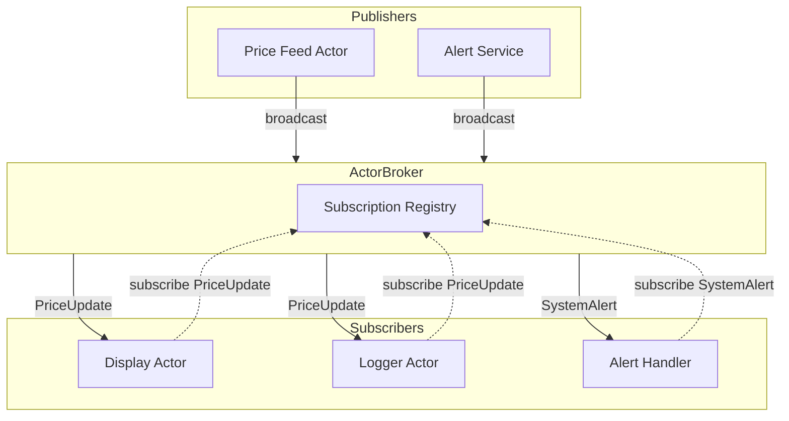

Sometimes you need to notify multiple actors about an event. Instead of sending messages to each one individually, use the broker to broadcast to all subscribers.

---

## The Broker

Every Acton runtime has a broker - think of it as a bulletin board where actors can post announcements and subscribe to topics.

```rust
let mut runtime = ActonApp::launch();

// Get the broker
let broker = runtime.broker();

// Actors can also access it
actor.mutate_on::<SomeMessage>(|actor, ctx| {
    let broker = actor.broker();
    // ...
});
```

---

## Subscribing to Messages

Actors subscribe to receive specific message types:

```rust
// Get the actor's handle before starting
let handle = actor.handle().clone();

// Subscribe to message types
handle.subscribe::<PriceUpdate>().await;
handle.subscribe::<SystemAlert>().await;

// Now start the actor
let handle = actor.start().await;
```


Subscribe *before* calling `start()` to ensure you don't miss any broadcasts sent immediately after startup.


---

## Broadcasting Messages

Anyone with access to the broker can broadcast:

```rust
let broker = runtime.broker();

// Broadcast to all subscribers
broker.broadcast(PriceUpdate {
    symbol: "ACME".into(),
    price: 123.45,
}).await;
```

From within a handler:

```rust
actor.mutate_on::<PriceChanged>(|actor, ctx| {
    let broker = actor.broker().clone();
    let update = PriceUpdate {
        symbol: ctx.message().symbol.clone(),
        price: ctx.message().new_price,
    };

    Reply::pending(async move {
        broker.broadcast(update).await;
    })
});
```

---

## Example: Price Feed

```rust
#[acton_message]
struct PriceUpdate {
    symbol: String,
    price: f64,
}

// Price display actor
let mut display = runtime.new_actor::<PriceDisplay>();
display.mutate_on::<PriceUpdate>(|actor, ctx| {
    let update = ctx.message();
    println!("{}: ${:.2}", update.symbol, update.price);
    Reply::ready()
});
display.handle().subscribe::<PriceUpdate>().await;
let _display = display.start().await;

// Price logger actor
let mut logger = runtime.new_actor::<PriceLogger>();
logger.mutate_on::<PriceUpdate>(|actor, ctx| {
    actor.model.history.push(ctx.message().clone());
    Reply::ready()
});
logger.handle().subscribe::<PriceUpdate>().await;
let _logger = logger.start().await;

// Broadcast reaches both
let broker = runtime.broker();
broker.broadcast(PriceUpdate {
    symbol: "ACME".into(),
    price: 150.0,
}).await;
```

---

## Architecture



---

## Subscription Lifecycle

```mermaid
sequenceDiagram
    participant Actor
    participant Handle as ActorHandle
    participant Broker as ActorBroker
    participant Registry

    Actor->>Handle: subscribe::<MsgType>()
    Handle->>Broker: Register subscription
    Broker->>Registry: Add subscriber
    Registry-->>Actor: Subscribed

    Note over Actor,Registry: Later...

    Broker->>Registry: Lookup MsgType subscribers
    Registry-->>Broker: [Actor, ...]
    Broker->>Actor: Deliver broadcast
```

---

## Unsubscribing

Actors can unsubscribe from message types:

```rust
handle.unsubscribe::<PriceUpdate>().await;
```

Actors automatically unsubscribe from everything when they stop.

---

## Multiple Message Types

Subscribe to as many types as needed:

```rust
let handle = actor.handle().clone();

handle.subscribe::<PriceUpdate>().await;
handle.subscribe::<VolumeUpdate>().await;
handle.subscribe::<TradeExecuted>().await;
handle.subscribe::<MarketOpen>().await;
handle.subscribe::<MarketClose>().await;

let handle = actor.start().await;
```

---

## Filtering Broadcasts

The broker delivers all broadcasts of a type. Filter in your handler:

```rust
actor.mutate_on::<PriceUpdate>(|actor, ctx| {
    let update = ctx.message();

    // Only care about specific symbols
    if !actor.model.watched_symbols.contains(&update.symbol) {
        return Reply::ready();
    }

    // Process the update
    actor.model.prices.insert(update.symbol.clone(), update.price);
    Reply::ready()
});
```

---

## Patterns

### Event Bus

Use the broker as a central event bus:

```rust
// Define events
#[acton_message]
struct UserLoggedIn { user_id: String }

#[acton_message]
struct OrderPlaced { order_id: String, user_id: String }

#[acton_message]
struct PaymentReceived { order_id: String, amount: f64 }

// Analytics subscribes to everything
analytics.handle().subscribe::<UserLoggedIn>().await;
analytics.handle().subscribe::<OrderPlaced>().await;
analytics.handle().subscribe::<PaymentReceived>().await;

// Notification service only cares about orders
notifications.handle().subscribe::<OrderPlaced>().await;

// Publishers broadcast events
broker.broadcast(UserLoggedIn { user_id: "123".into() }).await;
broker.broadcast(OrderPlaced {
    order_id: "ORD-456".into(),
    user_id: "123".into(),
}).await;
```

### System Alerts

Broadcast system-wide alerts:

```rust
#[acton_message]
enum SystemAlert {
    Shutdown { in_seconds: u32 },
    MaintenanceMode,
    NormalOperation,
}

// All actors that need to respond to alerts subscribe
handle.subscribe::<SystemAlert>().await;

// Handler
actor.mutate_on::<SystemAlert>(|actor, ctx| {
    match ctx.message() {
        SystemAlert::Shutdown { in_seconds } => {
            actor.model.accepting_new_work = false;
            // Finish current work...
        }
        SystemAlert::MaintenanceMode => {
            actor.model.in_maintenance = true;
        }
        SystemAlert::NormalOperation => {
            actor.model.in_maintenance = false;
            actor.model.accepting_new_work = true;
        }
    }
    Reply::ready()
});
```

### Config Reload

Broadcast configuration changes:

```rust
#[acton_message]
struct ConfigReload {
    config: AppConfig,
}

// Actors that use config subscribe
worker.handle().subscribe::<ConfigReload>().await;
cache.handle().subscribe::<ConfigReload>().await;
rate_limiter.handle().subscribe::<ConfigReload>().await;

// When config changes
broker.broadcast(ConfigReload { config: new_config }).await;
```

### Health Checks

Periodic health broadcasts:

```rust
#[acton_message]
struct HealthCheck { request_id: Uuid }

#[acton_message]
struct HealthResponse {
    request_id: Uuid,
    actor_id: String,
    healthy: bool,
}

// Health monitor broadcasts checks
tokio::spawn(async move {
    let mut interval = tokio::time::interval(Duration::from_secs(30));
    loop {
        interval.tick().await;
        broker.broadcast(HealthCheck {
            request_id: Uuid::new_v4(),
        }).await;
    }
});

// Actors respond
actor.mutate_on::<HealthCheck>(|actor, ctx| {
    let request_id = ctx.message().request_id;
    let actor_id = actor.id().to_string();
    let healthy = actor.model.is_healthy();
    let reply = ctx.reply_envelope();

    Reply::pending(async move {
        reply.send(HealthResponse {
            request_id,
            actor_id,
            healthy,
        }).await;
    })
});
```

---

## Best Practices

### Use Specific Message Types

```rust
// Good: specific events
#[acton_message]
struct OrderCreated { order_id: String }

#[acton_message]
struct OrderShipped { order_id: String, tracking: String }

// Avoid: generic events
#[acton_message]
struct Event { event_type: String, data: Value }
```

### Don't Rely on Ordering

Broadcasts are delivered asynchronously. Don't assume order:

```rust
// Don't do this
broker.broadcast(Step1).await;
broker.broadcast(Step2).await;
broker.broadcast(Step3).await;
// Actors might receive in different orders!

// Instead, use explicit sequencing in messages
broker.broadcast(Step { number: 1 }).await;
```

### Keep Broadcasts Lightweight

```rust
// Good: small messages
#[acton_message]
struct PriceChanged {
    symbol: String,
    price: f64,
}

// Avoid: large payloads
#[acton_message]
struct DataDump {
    all_prices: HashMap<String, f64>,  // Could be huge!
    full_history: Vec<Trade>,
}
```

---

## Next Steps

- [Supervision](/docs/supervision) - Parent-child actor hierarchies
- [Request-Response](/docs/request-response) - Coordinating between actors
- [IPC Communication](/docs/ipc) - Pub/sub across process boundaries
