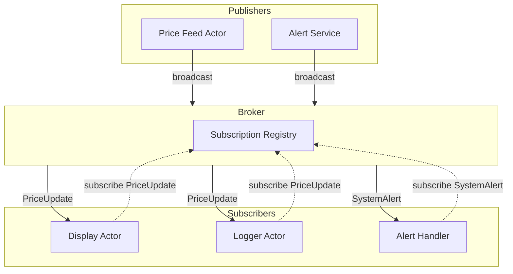

Sometimes you need to notify multiple actors about an event. Instead of sending messages to each one individually, use the broker to broadcast to all subscribers.

---

## The Broker

Every Acton runtime has a broker - think of it as a bulletin board where actors can post announcements and subscribe to topics.

```rust
let mut runtime = ActonApp::launch_async().await;

// Get the broker
let broker = runtime.broker();

// Actors can also access it
actor.mutate_on::<SomeMessage>(|actor, ctx| {
    let broker = actor.broker();
    // ...
});
```

---

## Subscribing to Messages

Actors subscribe to receive specific message types:

```rust
// Get the actor's handle before starting
let handle = actor.handle().clone();

// Subscribe to message types
handle.subscribe::<PriceUpdate>().await;
handle.subscribe::<SystemAlert>().await;

// Now start the actor
let handle = actor.start().await;
```


Subscribe *before* calling `start()` to ensure you don't miss any broadcasts sent immediately after startup.


---

## Broadcasting Messages

Anyone with access to the broker can broadcast:

```rust
let broker = runtime.broker();

// Broadcast to all subscribers
broker.broadcast(PriceUpdate {
    symbol: "ACME".into(),
    price: 123.45,
}).await;
```

From within a handler:

```rust
actor.mutate_on::<PriceChanged>(|actor, ctx| {
    let broker = actor.broker().clone();
    let update = PriceUpdate {
        symbol: ctx.message().symbol.clone(),
        price: ctx.message().new_price,
    };

    Reply::pending(async move {
        broker.broadcast(update).await;
    })
});
```

---

## Knowing a Broadcast Arrived

`broadcast` returns as soon as **the broker** has the message, not when subscribers do. This is deliberate: a broadcast has zero or many recipients, so there is nothing single to wait for.

Unlike a direct message, a broadcast also cannot answer for itself. The broker hands subscribers the payload alone, with no reply address, so there is nothing for a subscriber to reply *to*. **The broker is the only participant that can speak for a broadcast**, and `FlushBroadcasts` is how you ask it to:

```rust
broker.broadcast(PriceUpdate { symbol: "ACME".into(), price: 123.45 }).await;

// Answers BroadcastsFlushed. Because the broker's inbox is FIFO and its
// broadcast handler awaits fan-out, this reply cannot arrive until every
// earlier broadcast is sitting in every subscriber's inbox.
broker.ask(FlushBroadcasts).await?;
```

**That is delivery, not completion.** To know a *particular* subscriber has finished handling the broadcast, `ask` that subscriber afterwards. The broadcast is already ahead of your request in its inbox, so the reply proves it was handled:

```rust
broker.ask(FlushBroadcasts).await?;
let seen = subscriber_handle.ask(GetSeen).await?;
```


`ActorRuntime::shutdown_all` asks the broker to flush before it signals anything, so broadcasting and then shutting down is no longer a race. You need an explicit `FlushBroadcasts` when you want to assert something *before* shutting down, or when the broadcast has not been issued yet at the moment shutdown begins.

A `before_stop` hook that broadcasts to peers which are also stopping is the main case that still cannot be waited for: there is nothing to flush yet when shutdown starts.



Flushing on every `broadcast` was considered and rejected. Inboxes are bounded, so an actor that broadcasts from inside a mutable handler would block inline awaiting the broker's acknowledgement, while the broker blocked pushing into a full inbox, possibly that same actor's. That is a deadlock, and broadcasting from a handler is a common pattern.


---

## Example: Price Feed

```rust
#[acton_message]
struct PriceUpdate {
    symbol: String,
    price: f64,
}

// Price display actor
let mut display = runtime.new_actor::<PriceDisplay>();
display.mutate_on::<PriceUpdate>(|actor, ctx| {
    let update = ctx.message();
    println!("{}: ${:.2}", update.symbol, update.price);
    Reply::ready()
});
display.handle().subscribe::<PriceUpdate>().await;
let _display = display.start().await;

// Price logger actor
let mut logger = runtime.new_actor::<PriceLogger>();
logger.mutate_on::<PriceUpdate>(|actor, ctx| {
    actor.model.history.push(ctx.message().clone());
    Reply::ready()
});
logger.handle().subscribe::<PriceUpdate>().await;
let _logger = logger.start().await;

// Broadcast reaches both
let broker = runtime.broker();
broker.broadcast(PriceUpdate {
    symbol: "ACME".into(),
    price: 150.0,
}).await;
```

---

## Architecture


```mermaid
graph TB
    subgraph Publishers
        Pub1["Price Feed Actor"]
        Pub2["Alert Service"]
    end

    subgraph Broker["Broker"]
        Registry["Subscription Registry"]
    end

    subgraph Subscribers
        Sub1["Display Actor"]
        Sub2["Logger Actor"]
        Sub3["Alert Handler"]
    end

    Pub1 -->|broadcast| Broker
    Pub2 -->|broadcast| Broker

    Broker -->|PriceUpdate| Sub1
    Broker -->|PriceUpdate| Sub2
    Broker -->|SystemAlert| Sub3

    Sub1 -.->|subscribe PriceUpdate| Registry
    Sub2 -.->|subscribe PriceUpdate| Registry
    Sub3 -.->|subscribe SystemAlert| Registry
```

---

## Subscription Lifecycle

```mermaid
sequenceDiagram
    participant Actor
    participant Handle as ActorHandle
    participant Broker as Broker
    participant Registry

    Actor->>Handle: subscribe::<MsgType>()
    Handle->>Broker: Register subscription
    Broker->>Registry: Add subscriber
    Registry-->>Actor: Subscribed

    Note over Actor,Registry: Later...

    Broker->>Registry: Lookup MsgType subscribers
    Registry-->>Broker: [Actor, ...]
    Broker->>Actor: Deliver broadcast
```

---

## Unsubscribing

Actors can unsubscribe from message types:

```rust
handle.unsubscribe::<PriceUpdate>();
```

The call is fire-and-forget: it queues the removal request with the broker and
returns immediately. When you need to know the request has reached the broker
before continuing (for example, before broadcasting again in a test), use the
awaitable variant:

```rust
handle.unsubscribe_async::<PriceUpdate>().await;
```

Either way, only the subscription for the given message type is removed; any
other subscriptions held by the actor keep delivering.

Actors automatically unsubscribe from everything when they stop, so stopped
actors never linger in the broker's subscription registry.


Automatic cleanup runs on every termination path. With the default
`catch-handler-panics` feature a panicking handler never terminates the actor
in the first place; with the feature disabled, a handler panic terminates the
actor through the normal shutdown path, which removes its subscriptions before
the parent is notified.


---

## Multiple Message Types

Subscribe to as many types as needed:

```rust
let handle = actor.handle().clone();

handle.subscribe::<PriceUpdate>().await;
handle.subscribe::<VolumeUpdate>().await;
handle.subscribe::<TradeExecuted>().await;
handle.subscribe::<MarketOpen>().await;
handle.subscribe::<MarketClose>().await;

let handle = actor.start().await;
```

---

## Filtering Broadcasts

The broker delivers all broadcasts of a type. Filter in your handler:

```rust
actor.mutate_on::<PriceUpdate>(|actor, ctx| {
    let update = ctx.message();

    // Only care about specific symbols
    if !actor.model.watched_symbols.contains(&update.symbol) {
        return Reply::ready();
    }

    // Process the update
    actor.model.prices.insert(update.symbol.clone(), update.price);
    Reply::ready()
});
```

---

## Patterns

### Event Bus

Use the broker as a central event bus:

```rust
// Define events
#[acton_message]
struct UserLoggedIn { user_id: String }

#[acton_message]
struct OrderPlaced { order_id: String, user_id: String }

#[acton_message]
struct PaymentReceived { order_id: String, amount: f64 }

// Analytics subscribes to everything
analytics.handle().subscribe::<UserLoggedIn>().await;
analytics.handle().subscribe::<OrderPlaced>().await;
analytics.handle().subscribe::<PaymentReceived>().await;

// Notification service only cares about orders
notifications.handle().subscribe::<OrderPlaced>().await;

// Publishers broadcast events
broker.broadcast(UserLoggedIn { user_id: "123".into() }).await;
broker.broadcast(OrderPlaced {
    order_id: "ORD-456".into(),
    user_id: "123".into(),
}).await;
```

### System Alerts

Broadcast system-wide alerts:

```rust
#[acton_message]
enum SystemAlert {
    Shutdown { in_seconds: u32 },
    MaintenanceMode,
    NormalOperation,
}

// All actors that need to respond to alerts subscribe
handle.subscribe::<SystemAlert>().await;

// Handler
actor.mutate_on::<SystemAlert>(|actor, ctx| {
    match ctx.message() {
        SystemAlert::Shutdown { in_seconds } => {
            actor.model.accepting_new_work = false;
            // Finish current work...
        }
        SystemAlert::MaintenanceMode => {
            actor.model.in_maintenance = true;
        }
        SystemAlert::NormalOperation => {
            actor.model.in_maintenance = false;
            actor.model.accepting_new_work = true;
        }
    }
    Reply::ready()
});
```

### Config Reload

Broadcast configuration changes:

```rust
#[acton_message]
struct ConfigReload {
    config: AppConfig,
}

// Actors that use config subscribe
worker.handle().subscribe::<ConfigReload>().await;
cache.handle().subscribe::<ConfigReload>().await;
rate_limiter.handle().subscribe::<ConfigReload>().await;

// When config changes
broker.broadcast(ConfigReload { config: new_config }).await;
```

### Health Checks

Periodic health broadcasts:

```rust
#[acton_message]
struct HealthCheck { request_id: Uuid }

#[acton_message]
struct HealthResponse {
    request_id: Uuid,
    actor_id: String,
    healthy: bool,
}

// Health monitor broadcasts checks
tokio::spawn(async move {
    let mut interval = tokio::time::interval(Duration::from_secs(30));
    loop {
        interval.tick().await;
        broker.broadcast(HealthCheck {
            request_id: Uuid::new_v4(),
        }).await;
    }
});

// Actors respond
actor.mutate_on::<HealthCheck>(|actor, ctx| {
    let request_id = ctx.message().request_id;
    let actor_id = actor.id().to_string();
    let healthy = actor.model.is_healthy();
    let reply = ctx.reply_envelope();

    Reply::pending(async move {
        reply.send(HealthResponse {
            request_id,
            actor_id,
            healthy,
        }).await;
    })
});
```

---

## Best Practices

### Use Specific Message Types

```rust
// Good: specific events
#[acton_message]
struct OrderCreated { order_id: String }

#[acton_message]
struct OrderShipped { order_id: String, tracking: String }

// Avoid: generic events
#[acton_message]
struct Event { event_type: String, data: Value }
```

### Know exactly what ordering you get

Per subscriber, broadcasts arrive in the order they were broadcast. The broker's inbox is FIFO and its broadcast handler awaits fan-out before dequeuing the next message, so this holds:

```rust
broker.broadcast(Step1).await;
broker.broadcast(Step2).await;
broker.broadcast(Step3).await;
// Every subscriber's inbox holds Step1, Step2, Step3, in that order.
```

What you do **not** get is any relationship *between* subscribers. Each works its inbox at its own pace, so subscriber A can be on `Step3` while subscriber B is still on `Step1`. If one subscriber's work must precede another's, that is a dependency between two actors, and the broker is the wrong tool for expressing it: have the second actor wait on the first.

You also do not get delivery on return from `broadcast`, which is what the next section is about.

### Keep Broadcasts Lightweight

```rust
// Good: small messages
#[acton_message]
struct PriceChanged {
    symbol: String,
    price: f64,
}

// Avoid: large payloads
#[acton_message]
struct DataDump {
    all_prices: HashMap<String, f64>,  // Could be huge!
    full_history: Vec<Trade>,
}
```

---

## Next Steps

- [Supervision](/docs/core-concepts/supervision-basics) - Parent-child actor hierarchies
- [Request-Response](/docs/building-apps/request-response) - Coordinating between actors
- [IPC Communication](/docs/advanced/ipc) - Pub/sub across process boundaries
