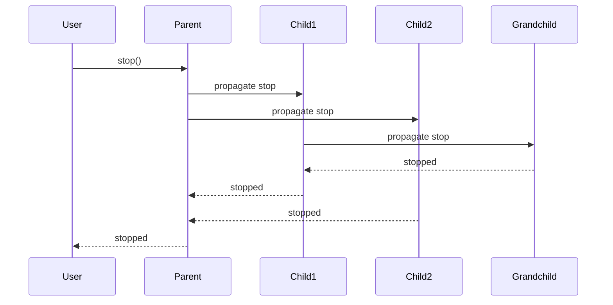

Actors can create and supervise child actors. When a parent stops, all its children automatically stop too. This creates a natural hierarchy for managing complex systems.

---

## Creating Child Actors

Use `supervise` to create a child actor:

```rust
parent.mutate_on::<SpawnWorker>(|actor, ctx| {
    let parent_handle = actor.handle().clone();

    Reply::pending(async move {
        // Create child actor builder
        let mut worker = parent_handle.new_child::<WorkerState>();

        // Configure the child
        worker.mutate_on::<Task>(|actor, ctx| {
            // Handle tasks
            Reply::ready()
        });

        // Start as supervised child
        let child_handle = parent_handle.supervise(worker).await;

        // Store reference if needed
        // actor.model.workers.push(child_handle);
    })
});
```

---

## Supervision Hierarchy

Child actors form a tree under their parent:

```text
payment-service/                     # Root actor
├── payment-service/validator        # Child
├── payment-service/processor        # Child
│   └── payment-service/processor/retry-queue   # Grandchild
└── payment-service/logger           # Child
```

### ERN (Entity Resource Names)

Every actor has a unique identifier that reflects its position in the hierarchy:

```rust
// Root actor
let service = runtime.new_actor_with_name::<PaymentService>("payment-service");
// ID: "payment-service"

// Child actor
let worker = service_handle.new_child_with_name::<Worker>("worker-1");
// ID: "payment-service/worker-1"

// Grandchild
let queue = worker_handle.new_child_with_name::<Queue>("retry");
// ID: "payment-service/worker-1/retry"
```

---

## Cascading Shutdown

When a parent stops, all children stop automatically:



**Key behavior:**
- Children receive stop signal before parent completes
- Grandchildren stop before children complete
- Parent waits for all descendants to stop
- Lifecycle hooks run at each level

---

## Worker Pool Pattern

Create multiple workers under a supervisor:

```rust
#[acton_actor]
struct Supervisor {
    workers: Vec<ActorHandle>,
    next_worker: usize,
}

supervisor.mutate_on::<Initialize>(|actor, ctx| {
    let self_handle = actor.handle().clone();
    let worker_count = ctx.message().worker_count;

    Reply::pending(async move {
        let mut workers = Vec::new();

        for i in 0..worker_count {
            let mut worker = self_handle.new_child_with_name::<Worker>(
                &format!("worker-{}", i)
            );

            worker.mutate_on::<Task>(|actor, ctx| {
                // Process task
                Reply::ready()
            });

            let handle = self_handle.supervise(worker).await;
            workers.push(handle);
        }

        // Store workers via self-message
        self_handle.send(WorkersReady { workers }).await;
    })
});

supervisor.mutate_on::<WorkersReady>(|actor, ctx| {
    actor.model.workers = ctx.message().workers.clone();
    Reply::ready()
});

// Route tasks to workers (round-robin)
supervisor.mutate_on::<Task>(|actor, ctx| {
    let worker = &actor.model.workers[actor.model.next_worker];
    actor.model.next_worker = (actor.model.next_worker + 1) % actor.model.workers.len();

    let task = ctx.message().clone();
    let worker = worker.clone();

    Reply::pending(async move {
        worker.send(task).await;
    })
});
```

---

## Dynamic Children

Create children on demand:

```rust
#[acton_actor]
struct SessionManager {
    sessions: HashMap<String, ActorHandle>,
}

session_manager.mutate_on::<CreateSession>(|actor, ctx| {
    let session_id = ctx.message().session_id.clone();
    let self_handle = actor.handle().clone();

    Reply::pending(async move {
        let mut session = self_handle.new_child_with_name::<Session>(&session_id);

        session.mutate_on::<SessionMessage>(|actor, ctx| {
            // Handle session messages
            Reply::ready()
        });

        let handle = self_handle.supervise(session).await;

        // Notify self to store the handle
        self_handle.send(SessionCreated {
            session_id,
            handle,
        }).await;
    })
});

session_manager.mutate_on::<SessionCreated>(|actor, ctx| {
    let msg = ctx.message();
    actor.model.sessions.insert(msg.session_id.clone(), msg.handle.clone());
    Reply::ready()
});

// Route messages to sessions
session_manager.mutate_on::<ForSession>(|actor, ctx| {
    if let Some(session) = actor.model.sessions.get(&ctx.message().session_id) {
        let session = session.clone();
        let message = ctx.message().message.clone();

        Reply::pending(async move {
            session.send(message).await;
        })
    } else {
        Reply::ready()
    }
});
```

---

## Child Lifecycle Hooks

Children have their own lifecycle hooks:

```rust
let mut child = parent_handle.new_child::<ChildState>();

child
    .before_start(|actor| {
        println!("Child starting under parent");
        Reply::ready()
    })
    .after_stop(|actor| {
        println!("Child stopped");
        Reply::ready()
    });

let child_handle = parent_handle.supervise(child).await;
```

---

## Root vs Child Actors

| Aspect | Root Actor | Child Actor |
|--------|------------|-------------|
| Created via | `runtime.new_actor()` | `parent.new_child()` |
| Stopped by | `runtime.shutdown_all()` or explicit stop | Parent stopping or explicit stop |
| ERN format | `actor-name` | `parent/child-name` |
| Tracked in | Runtime's root registry | Parent's children list |

---

## Stopping Children

### Stop a Specific Child

```rust
manager.mutate_on::<CloseSession>(|actor, ctx| {
    let session_id = &ctx.message().session_id;

    if let Some(handle) = actor.model.sessions.remove(session_id) {
        Reply::pending(async move {
            handle.stop().await;
        })
    } else {
        Reply::ready()
    }
});
```

### Stop All Children (Stopping Parent)

```rust
// When parent stops, all children stop automatically
parent_handle.stop().await;
```

---

## Supervision Patterns

### One-for-One Restart

Restart individual failed children:

```rust
#[acton_message]
struct ChildFailed { child_id: String }

supervisor.mutate_on::<ChildFailed>(|actor, ctx| {
    let child_id = ctx.message().child_id.clone();
    let self_handle = actor.handle().clone();

    // Remove failed child
    actor.model.children.remove(&child_id);

    Reply::pending(async move {
        // Create replacement
        let mut new_child = self_handle.new_child_with_name::<Worker>(&child_id);
        // Configure...
        let handle = self_handle.supervise(new_child).await;

        self_handle.send(ChildReplaced { child_id, handle }).await;
    })
});
```

### Circuit Breaker Supervisor

```rust
#[acton_actor]
struct CircuitBreakerSupervisor {
    child: Option<ActorHandle>,
    failures: u32,
    max_failures: u32,
    reset_after: Duration,
}

supervisor.mutate_on::<ChildFailed>(|actor, ctx| {
    actor.model.failures += 1;

    if actor.model.failures >= actor.model.max_failures {
        println!("Circuit open: too many failures");
        actor.model.child = None; // Don't restart

        let self_handle = actor.handle().clone();
        let reset_after = actor.model.reset_after;

        return Reply::pending(async move {
            tokio::time::sleep(reset_after).await;
            self_handle.send(ResetCircuit).await;
        });
    }

    // Restart the child
    let self_handle = actor.handle().clone();
    Reply::pending(async move {
        self_handle.send(RestartChild).await;
    })
});

supervisor.mutate_on::<ResetCircuit>(|actor, ctx| {
    actor.model.failures = 0;
    let self_handle = actor.handle().clone();

    Reply::pending(async move {
        self_handle.send(RestartChild).await;
    })
});
```

---

## Best Practices

### Use Meaningful Names

```rust
// Good: descriptive hierarchy
let order_processor = runtime.new_actor_with_name::<Processor>("order-processor");
let validator = order_processor.new_child_with_name::<Validator>("validator");
let persister = order_processor.new_child_with_name::<Persister>("persister");

// ERNs: order-processor/validator, order-processor/persister
```

### Keep Supervision Trees Shallow

```rust
// Prefer flat hierarchies when possible
supervisor/
├── worker-1
├── worker-2
├── worker-3
└── worker-4

// Instead of deep nesting
supervisor/
└── manager/
    └── sub-manager/
        └── worker
```

### Store Child Handles

```rust
#[acton_actor]
struct Parent {
    children: HashMap<String, ActorHandle>,
}

// Store handle when child is created
actor.model.children.insert(child_id, child_handle);

// Remove when child stops
actor.model.children.remove(&child_id);
```

---

## Next Steps

- [Pub/Sub](/docs/pub-sub) - Broadcasting messages across actors
- [Actor Lifecycle](/docs/actor-lifecycle) - Lifecycle hooks in detail
- [Configuration](/docs/configuration) - Shutdown timeouts and settings
